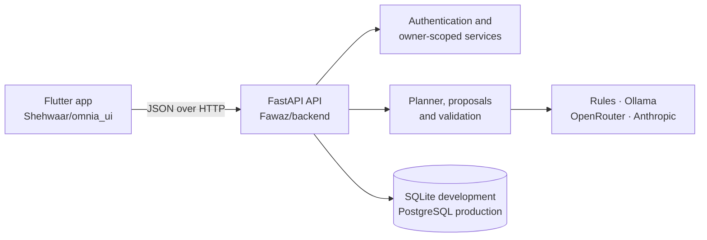

# OMNIA

**Everything. One plan.**

OMNIA is an AI-assisted personal planning app that brings study, tasks, activity, sleep, nutrition and focus into one daily system. Instead of treating each area as a separate tracker, OMNIA uses their shared context to build a realistic day plan—and can safely adapt that plan when life changes.


## Highlights

- **Adaptive daily planning** — generate a plan, request a change in plain language, preview it and apply it explicitly.
- **Study and revision** — organise subjects, exams, backlog topics, study sessions and revision blocks.
- **Tasks and commitments** — manage priorities, due dates, estimates and fixed calendar commitments.
- **Health context** — track activity, workouts, sleep and meals so planning can account for energy and recovery.
- **Ask Omnia** — receive context-aware guidance through a server-controlled AI provider.
- **Progress and social features** — streaks, achievements, history, friends, groups and challenges.
- **Secure accounts** — authenticated, owner-scoped data with tokens stored in the device's secure storage.
- **Neo-brutalist interface** — a bold Flutter UI with light and dark themes, hard shadows and accessible colour contrast.

## Adaptive replanning

Replanning is designed as a reviewable transaction, not an invisible AI edit:

1. The user asks for a change, such as _“Skip my workout and add revision time.”_
2. The backend creates a temporary proposal without changing the active plan.
3. The app presents only the useful differences:

   ```text
   Removed Evening Workout
   Added Revision
   ```

4. The user applies or cancels the proposal.
5. Applying creates a new immutable plan revision.

Behind the compact preview, the backend still performs ownership checks, expiry and stale-state detection, context fingerprinting, schedule validation, operation replay and concurrency locking. A failed, expired, dismissed or outdated proposal never changes the plan.

Supported operations are `ADD`, `REMOVE`, `MOVE`, `RESCHEDULE`, `SHORTEN` and `UNCHANGED`. Unchanged items are hidden from the normal interface.

## Architecture



The frontend contains no AI provider secrets. It communicates only with the OMNIA API; provider credentials and selection remain on the server.

## Repository layout

```text
omnia/
├── Shehwaar/
│   └── omnia_ui/            # Canonical Flutter application
├── Fawaz/
│   ├── backend/             # FastAPI application, migrations and tests
│   ├── docs/                # Backend architecture, API and integration guides
│   └── docker-compose.yml   # PostgreSQL + backend development stack
├── docs/omnia-vault/        # Product, architecture and roadmap documentation
└── START_OMNIA.bat          # One-click Windows development launcher
```

`Fawaz` is backend-only. The repository has one Flutter frontend: [`Shehwaar/omnia_ui`](Shehwaar/omnia_ui).

## Quick start

### One-click Windows development

The launcher starts or reuses Ollama, runs database migrations, starts the backend, opens the configured Android emulator and runs the canonical Flutter app.

Prerequisites:

- Flutter with Android tooling
- Python 3.11 and the backend virtual environment
- An Android Virtual Device
- Ollama and an installed model, when using the local assistant

Copy the launcher configuration and edit its paths/model for your machine:

```powershell
Copy-Item .\Shehwaar\omnia_ui\integration\launcher.env.example `
  .\Shehwaar\omnia_ui\integration\.env.launcher
```

Run the safe preflight check:

```powershell
powershell -NoProfile -ExecutionPolicy Bypass `
  -File .\Shehwaar\omnia_ui\integration\start_omnia.ps1 -Role Check
```

Then double-click `START_OMNIA.bat`, or run:

```powershell
.\START_OMNIA.bat
```

The launcher is documented in [`Shehwaar/omnia_ui/integration/LAUNCHER.md`](Shehwaar/omnia_ui/integration/LAUNCHER.md).

### Manual backend setup on Windows

```powershell
cd .\Fawaz\backend
py -3.11 -m venv .venv
.\.venv\Scripts\python.exe -m pip install -r requirements-dev.txt
Copy-Item .env.example .env
.\.venv\Scripts\python.exe -m alembic upgrade head
.\.venv\Scripts\python.exe -m uvicorn app.main:app --reload --host 127.0.0.1 --port 8000
```

Using `python.exe -m alembic` avoids requiring a globally installed `alembic` command.

The local backend defaults to SQLite. Once it is running:

- Health: <http://localhost:8000/api/health/ready>
- API documentation: <http://localhost:8000/api/docs>

### Run the Flutter app

In another terminal:

```powershell
cd .\Shehwaar\omnia_ui
flutter pub get
flutter run --dart-define=OMNIA_DATA=api
```

Debug builds automatically use `http://10.0.2.2:8000/api` on the Android emulator and `http://localhost:8000/api` on desktop, iOS and web.

For UI development without a backend or sign-in:

```powershell
cd .\Shehwaar\omnia_ui
flutter run
```

### Docker backend

```powershell
cd .\Fawaz
Copy-Item .env.example .env
# Set POSTGRES_PASSWORD and a 32+ character AUTH_SECRET in .env
docker compose up --build
```

Optional fictional demo data:

```powershell
docker compose exec backend python -m app.scripts.seed
```

## Configuration

Backend configuration belongs in an untracked `Fawaz/backend/.env` for local Python runs or `Fawaz/.env` for Docker Compose. Start from the matching `.env.example` file.

| Variable | Purpose |
|---|---|
| `DATABASE_URL` | SQLite for local development or PostgreSQL in production |
| `AUTH_SECRET` | Signs access tokens; use at least 32 random characters in production |
| `PLANNER_AI_PROVIDER` | Daily planner provider: `rules`, `ollama`, `openrouter` or `anthropic` |
| `ASSISTANT_PROVIDER` | Ask Omnia provider: `off`, `ollama` or `openrouter` |
| `ASSISTANT_BASE_URL` | Local Ollama-compatible endpoint |
| `ASSISTANT_MODEL` | Model used by Ask Omnia |
| `OPENROUTER_API_KEY` | Optional server-side OpenRouter credential |
| `AI_API_KEY` | Optional server-side Anthropic credential |
| `CORS_ORIGINS` | Browser origins allowed to call the API in production |
| `PUBLIC_BASE_URL` | Public API URL used for generated integration links |

Do not commit real `.env` files, access tokens or provider keys.

## Testing

Backend:

```powershell
cd .\Fawaz\backend
.\.venv\Scripts\python.exe -m ruff check .
.\.venv\Scripts\python.exe -m pytest
```

Flutter:

```powershell
cd .\Shehwaar\omnia_ui
flutter analyze
flutter test
```

The automated suites cover authentication, ownership isolation, migrations, planner fallback, proposal lifecycle and validation, API mapping, accessibility, light/dark layouts and the adaptive-replanning experience.

## API and project documentation

- [Backend README](Fawaz/README.md)
- [Backend architecture](Fawaz/docs/ARCHITECTURE.md)
- [Frontend/backend integration](Fawaz/docs/INTEGRATION.md)
- [Adaptive replanning contract](Fawaz/backend/docs/adaptive-replanning.md)
- [Flutter application guide](Shehwaar/README.md)
- [Flutter integration guide](Shehwaar/omnia_ui/integration/README.md)
- [Product and architecture vault](docs/omnia-vault/00%20-%20OMNIA.md)

## Development notes

- Run migrations before starting the API: `python -m alembic upgrade head` from `Fawaz/backend` using its virtual-environment Python.
- Android emulators reach services on the host machine through `10.0.2.2`, not `localhost`.
- Keep several gigabytes free on the system drive for Flutter, Gradle and Android emulator builds.
- The deterministic rules provider works without a cloud AI key. Optional providers must be configured only on the backend.

## Project status

OMNIA is under active development as a final-year team project. Some capabilities are complete end-to-end, while others remain local, sample-backed or staged for deeper backend integration. See the linked component documentation for the most detailed current status.

