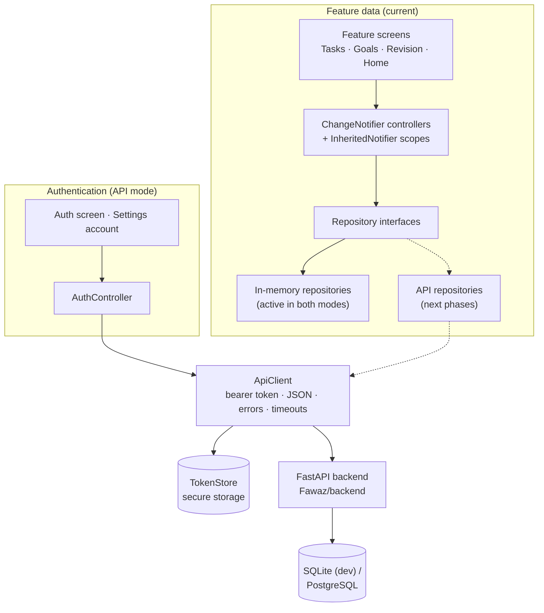
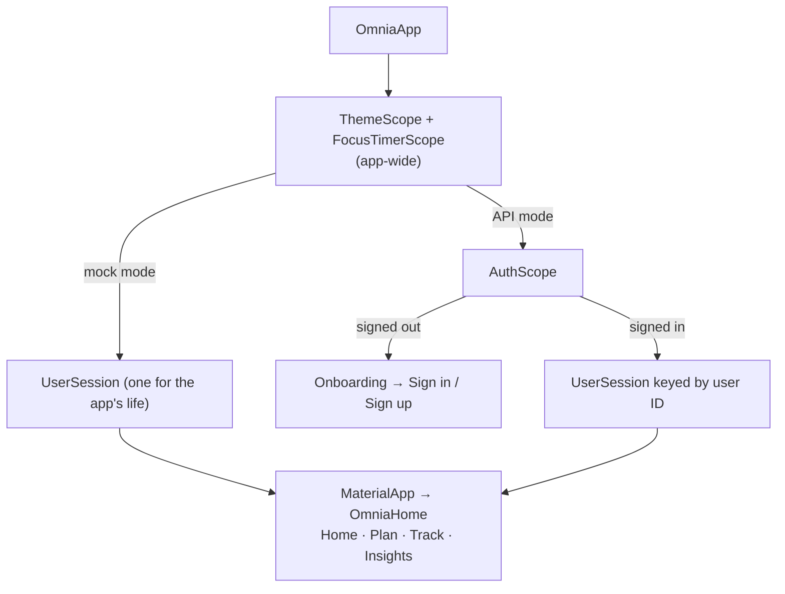

# OMNIA — Flutter Frontend

**One app for study, tasks, goals, focus, fitness and sleep, designed to eventually plan your day across all of them.**

This folder holds the canonical Flutter frontend for OMNIA, a final-year team project. It covers the app's screens, state management, local data layer, and the client side of backend integration: API access, authentication and user sessions.

> **Current checkpoint:** Tasks, long-term Goals, the Focus Timer and study revision work on local, in-memory data. Accounts and sign-in are integrated with the team's FastAPI backend. Other feature data is being moved to the backend one module at a time. See [Backend integration status](#backend-integration-status).

---

## Contents

- [Why OMNIA?](#why-omnia)
- [Current status](#current-status)
- [Features](#features)
- [Authentication and sessions](#authentication-and-sessions)
- [Mock mode vs API mode](#mock-mode-vs-api-mode)
- [Architecture](#architecture)
- [Project structure](#project-structure)
- [Design system](#design-system)
- [Accessibility](#accessibility)
- [Tech stack](#tech-stack)
- [Getting started](#getting-started)
- [Running with the backend](#running-with-the-backend)
- [Testing](#testing)
- [Backend integration status](#backend-integration-status)
- [Roadmap](#roadmap)
- [Team context](#team-context)

---

## Why OMNIA?

Most people manage their lives across separate apps: a to-do list, a study planner, a workout log, a sleep tracker. Each one works on its own, and none of them knows what the others know.

OMNIA's aim is to bring these areas into one system and, in the long run, to understand how they affect each other:

- an approaching exam should raise the priority of study;
- a poor night's sleep should lighten the day's workload and favour recovery;
- missed tasks should reshape the daily plan;
- workout consistency and progression should inform fitness recommendations;
- completed goals and milestones should feed into future planning.

That cross-domain planning is the **product vision**. It is not implemented yet. What exists today is the foundation it needs: structured, reliable data for each area, and a frontend architecture that can move that data to the backend where a planner can use it.

---

## Current status

| Area | Status | Notes |
|---|---|---|
| Onboarding | ✅ Implemented | Multi-page intro with skip, back and swipe navigation |
| Tasks | ✅ Implemented (local data) | Full create / edit / complete / delete flow |
| Long-term Goals | ✅ Implemented (local data) | Measurable and completion-only goals |
| Focus Timer | ✅ Implemented (local) | Pomodoro timer shared across the whole app |
| Study revision session | 🟡 Partial (local data) | One revision session with sub-tasks; sample content |
| Authentication and accounts | ✅ Implemented (real backend) | API mode only |
| Settings | ✅ Implemented | Theme, onboarding preview (debug builds), account section in API mode |
| Light / dark theme | ✅ Implemented | Switchable in Settings |
| Home dashboard | 🟡 Partial | Live Tasks count and Goals preview; other figures are sample data |
| Plan | 🟡 UI with sample data | Timeline and list views of a fixed sample day |
| Track | 🟡 UI with sample data | Live Tasks tile; other figures are sample data |
| Insights | 🟡 UI with sample data | Weekly overview screen |
| AI planning and recommendations | ⏳ Planned | Not implemented in this frontend |

Screens that show sample data say so on screen (`SAMPLE DAY`, `SAMPLE DATA`).

---

## Features

### Tasks

- **Fields:** title, optional description, priority (low / normal / high), category, optional due date with an optional time, and optional estimated duration.
- **Actions:** create, edit, mark complete or incomplete with a checkbox, and delete after confirmation.
- **Ordering:** open tasks first, then by due date (undated last), then newest first.
- **States:** loading, empty, and error with a retry button.
- **Live counts:** the Home **Tasks** card and the Track **Tasks** tile read from the same controller, so they update as soon as a task changes.
- **Double taps:** a second operation on a task is ignored while the first is still in progress.

**Persistence:** tasks live in an in-memory repository in both modes today. Moving them to the backend is the next integration phase; the backend already has a tasks API.

### Long-term Goals

Goals are long-term objectives, such as *Read 12 books this year* or *Submit final-year project*. They come in two types.

**Measurable goals** record real quantities as a current value, a target value and a unit:

```
Read 12 books this year           7 / 12 books      58%
Finish DBMS chapters              6 / 10 chapters   60%
Incline Dumbbell Press            22.5 / 30 kg      75%
```

- The percentage is always **calculated** from current ÷ target. It is never entered or dragged.
- Decimals are supported.
- The percentage rounds down, so 100% means the target was actually reached.
- Values above the target are kept as they are (for example 32.5 / 30 kg). The progress bar caps at 100%.

**Completion-only goals** (for example *Submit final-year project*) have no numbers. They are simply active or completed, and show no progress bar or percentage.

**For both types:**

- **Actions:** create, edit, delete (with confirmation), complete and reopen.
- **Completion is always your decision.** Reaching a target doesn't complete a goal automatically, and completing a goal doesn't change its recorded values, so reopening restores the real progress.
- **Details:** optional description and target date.
- **Screen layout:** separate **Active** and **Completed** sections. Active goals are ordered by nearest target date.
- **Home preview:** the two most pressing active goals, read from the same controller as the Goals screen.

**Persistence:** Goals use an in-memory repository. These goals are separate from the backend's *daily targets* (study minutes, steps, tasks per day, sleep, calories), which live on the user profile. The two concepts are deliberately kept apart; see the [Roadmap](#roadmap).

### Focus Timer

- **Presets:** *Standard* (25 min focus / 5 min break) and *Deep focus* (50 / 10), plus a custom setting (focus 1–180 min, break 1–60 min, validated).
- **Controls:** start, pause, resume, reset and skip. Changing the preset during a session asks for confirmation first.
- **Phases:** focus and break alternate. Completed focus sessions are counted; skipped ones aren't.
- **Timing:** the countdown is measured against an end time rather than counted down tick by tick, so late or delayed ticks don't make it drift.
- **App-wide timer:** one timer for the whole app. It keeps running when you leave the timer screen, and a compact entry on the Plan screen shows the same running timer.
- **Where to find it:** from the Plan screen and from the revision session's **Start Focus Session** button.
- **Phase feedback:** when a phase ends, on any screen, the phone buzzes (a strong vibration) and a screen-reader announcement plays, exactly once.

**Persistence:** local only. The timer and its session count are not stored.

### Study and revision

- One study revision session (*DBMS Revision*), opened from Home or Plan.
- A checklist of revision sub-tasks.
- **Actions:** mark all done or not done, rename the session, and reset the sub-tasks (with confirmation, from a **More** menu).
- Changes are saved to an in-memory study repository and are undone if saving fails.
- Subject, exam, session and note content is sample data.

The adaptive study system (flashcards, quizzes, mastery tracking) is **planned**; see the [Roadmap](#roadmap).

### Home, Plan, Track and Insights

- **Home:** a greeting and a highlighted recommendation card, category cards, the Goals preview and a **Next up** agenda. Only the Tasks card and the Goals preview use live data; the rest is sample content.
- **Plan:** timeline and list views of a sample day. Revision items open the revision session. Rescheduling is not implemented, and the screen says so.
- **Track:** Study, Activity and Sleep figures are sample data; the Tasks tile is live.
- **Insights:** a weekly overview built from sample data.

### Settings

- Light / dark theme switch.
- **Preview onboarding** (debug builds only).
- **In API mode, when signed in**, an Account section: see [Authentication and sessions](#authentication-and-sessions).

---

## Authentication and sessions

Authentication is real in API mode: it talks to the team's FastAPI backend and has been checked manually on an Android emulator. The manual check covered registration, sign-in, the account screen, sign-out and sign-in again, and restoring the session after restarting the app.

**Supported:**

| Capability | Backend endpoint |
|---|---|
| Create account (name, email, password, time zone) | `POST /api/auth/register` |
| Sign in | `POST /api/auth/login` |
| Restore a stored session on launch | `GET /api/auth/me` |
| Sign out (this device) | Clears the stored token |
| Sign out everywhere | `POST /api/auth/logout-all` |
| Change password (signs out other devices) | `POST /api/auth/change-password` |
| Delete account (password confirmation) | `POST /api/auth/delete-account` |

**Behaviour:**

- **Launch:** a splash screen while the stored token is checked. A valid token goes straight into the app. With no token, the app shows onboarding, then the sign-in / sign-up screen. If the backend can't be reached, it shows **Couldn't reach OMNIA** with a retry button and keeps the token.
- **Registration:** the app checks the fields first (name, email format, password of at least 8 characters). Errors from the backend appear under the relevant field (for example an invalid email) or below the form (for example an email already in use).
- **Time zone:** pre-selected from the device's UTC offset and changeable before signing up. The backend uses it to decide when the user's day starts.
- **Session expiry:** if the backend rejects a token the app sent, the token is cleared, the user's session is closed, and the app returns to sign-in with *"Your session ended. Please sign in again."* If several requests fail at once, the user is signed out only once.
- **Wrong password:** the backend answers change-password and delete-account with **403**, not 401, so a wrong password is reported without signing the user out.
- **Token storage:** the device's secure storage (Android Keystore, iOS/macOS Keychain, Windows DPAPI, Linux libsecret). If secure storage isn't available, the token is kept in memory and the user signs in again after a restart.

### App-wide vs per-user state

State that belongs to one user sits inside a `UserSession` widget. In API mode it is keyed by the signed-in user's ID, so signing out, or signing in as someone else, disposes it and builds a fresh one. That way one user's local data can't carry over into another user's session.

| App-wide (created once) | Per user (`UserSession`) |
|---|---|
| `ThemeController` | `TaskController` |
| `FocusTimerController` (intentionally app-wide) | `GoalController` |
| `ApiClient` (API mode) | `RevisionController` |
| `AuthController` (API mode) | `AppDependencies` (feature repositories) |

In mock mode there is a single session for the app's whole life, so behaviour is unchanged from before authentication existed.

---

## Mock mode vs API mode

The app has two data modes, chosen when you build or run it.

| | Mock mode (default) | API mode |
|---|---|---|
| Command | `flutter run` | `flutter run --dart-define=OMNIA_DATA=api` |
| Sign-in | None | Real accounts on the FastAPI backend |
| Backend required | No | Yes |
| Tasks, Goals, Study | In-memory | **Still in-memory** (fresh for each signed-in session) |
| Typical use | UI work, demos, automated tests | Account and integration work |

In short, **in API mode today, authentication is real and feature data is still local.** This is a deliberate intermediate step: each feature moves to its API repository in its own phase, while mock mode stays available.

### Backend URL

The address comes from `ApiConfig`:

| Situation | URL used |
|---|---|
| `--dart-define=API_BASE_URL=<url>` given | That URL (any trailing `/` removed) |
| Debug build, Android emulator | `http://10.0.2.2:8000/api` |
| Debug build, web / iOS / desktop | `http://localhost:8000/api` |
| Release build without `API_BASE_URL` | None; the app shows *Server not configured* |

**Why `10.0.2.2`?** Inside the Android emulator, `localhost` means the emulator itself. `10.0.2.2` is the emulator's fixed address for the computer running it, which is where the backend is.

**Plain HTTP:** only debug Android builds are allowed to use plain `http://` (`usesCleartextTraffic` is set in the debug manifest only). The main manifest adds the `INTERNET` permission for release builds, which should use HTTPS. On a physical phone, pass your computer's LAN address, for example `--dart-define=API_BASE_URL=http://192.168.1.20:8000/api`.

---

## Architecture

The app is organised by feature. Each feature follows the same shape:

- **Screens** read state from a controller provided higher up the widget tree.
- **Controllers** are `ChangeNotifier`s that hold application state and call a repository. The Task and Goal controllers return `true` or `false` from each change rather than throwing.
- **Scopes** (`InheritedNotifier`, for example `TaskScope`, `GoalScope`, `FocusTimerScope`, `AuthScope`) make a controller available to every screen below it, with no state-management package.
- **Repository interfaces** (`TaskRepository`, `GoalRepository`, `StudyRepository`) separate the controllers from where data lives.
- **`AppDependencies`** is the one place that decides which repository implementation each feature uses.



Solid arrows are wired today. Dashed arrows are planned.

### How the app is wired together



### API layer (`lib/core/api`)

- **`ApiClient`:** the only place the app makes HTTP requests.
  - Supports `GET`, `POST`, `PATCH`, `PUT` and `DELETE`.
  - Adds `Authorization: Bearer <token>` when a token is stored.
  - Sends and receives JSON. Leaves null values out of query strings.
  - Times out after 20 seconds by default (overridable per call), including the time spent reading the response.
  - Tells the rest of the app, through `onUnauthorized`, when a token it sent is rejected.
- **`ApiException`:** turns the backend's `{"error": {code, message, details[]}}` format into one error type, with per-field messages (`fieldMessage('email')`). Connection problems and timeouts come out as a readable "can't reach OMNIA" error.
- **`ApiConfig`:** chooses the data mode and the backend URL (see above).
- **`json.dart`:** small helpers for reading JSON and for converting the backend's `YYYY-MM-DD` calendar dates.
- **`TokenStore`:** `SecureTokenStore` for the app, `MemoryTokenStore` for tests.

---

## Project structure

```
Shehwaar/
├── README.md
└── omnia_ui/
    ├── android/                  # includes debug cleartext + INTERNET permission
    ├── lib/
    │   ├── main.dart
    │   ├── app.dart              # OmniaApp: modes, auth gate, sessions, navigation
    │   ├── core/
    │   │   ├── api/              # ApiClient, ApiConfig, ApiException, JSON helpers
    │   │   ├── auth/             # AuthController, TokenStore, time zones
    │   │   ├── data/             # in-memory data source, mock data
    │   │   ├── models/           # shared models (User, OmniaCategory)
    │   │   ├── theme/            # colours, theme, surface/shadow styles
    │   │   ├── widgets/          # shared components
    │   │   ├── app_dependencies.dart
    │   │   └── session.dart      # UserSession (per-user state)
    │   └── features/
    │       ├── auth/             # sign in / sign up
    │       ├── focus/            # Focus Timer
    │       ├── goals/            # long-term Goals (domain, data, screens)
    │       ├── home/
    │       ├── insights/
    │       ├── onboarding/
    │       ├── plan/             # Plan + revision session
    │       ├── settings/
    │       ├── study/            # study domain + in-memory repository
    │       ├── tasks/            # Tasks (domain, data, screens)
    │       └── track/
    └── test/
        └── support/              # fake auth backend for tests
```

---

## Design system

OMNIA's visual style is neo-brutalist with an indigo/violet identity:

- **Solid surfaces:** thick outlines and unblurred, offset "hard" shadows (`SurfaceStyle`, `SurfaceShadow`, `HardCard`).
- **Bold typography:** heavy weights for headings and key figures.
- **Category colours:** a fixed pastel set (blue, yellow, mint, lilac) used consistently for study, tasks, activity and sleep, with separate tuned versions for dark mode.
- **Light and dark themes:** both built from one theme function. Outlines and text colours are chosen so they stay readable on bright fills in dark mode.
- **Shared components:** `HardCard`, `SolidAction` (the primary button), `ActionRow`, `OmniaProgressBar`, `AccentCircle`, `LabelTag`, `OmniaMark` (the logo), and shared loading, empty and error views.

New features, including the Goals screens and the auth screen, are built from these same components, so the app looks consistent from screen to screen.

---

## Accessibility

Accessibility has been worked on and is covered by automated tests. No formal WCAG audit has been carried out.

- **Screen-reader labels:** task and goal checkboxes are named after their item; progress bars say what they measure ("Study progress"); headings are marked as headings; bottom-navigation tabs report which one is selected.
- **No double announcements:** where a percentage appears as text next to a progress bar, only the bar announces it.
- **Announcements:** the end of a focus phase is spoken exactly once; the session-expired notice and sign-in errors are announced when they appear.
- **Large text:** key screens are tested at 200% text scaling on a small phone, including the Goals list and form and the auth screen in both themes. Layouts reflow rather than clipping; for example, action rows stack their buttons at large text sizes.
- **Contrast:** automated tests check that dark-mode accent and hero text keep a contrast ratio of at least 4.5 : 1.
- **Reduced motion:** onboarding jumps between pages instead of animating when the system asks for fewer animations.
- **Touch targets and controls:** tap targets are at least 48 dp; the password field has a labelled Show / Hide password button.

---

## Tech stack

**Frontend (this folder)**

| Technology | Version / constraint | Used for |
|---|---|---|
| Flutter | 3.47.5 (stable) | UI framework |
| Dart | 3.13.4 (SDK `^3.13.4`) | Language |
| Material 3 | bundled with Flutter | Components and theming |
| `http` | `^1.2.2` | Backend requests (`ApiClient`) |
| `flutter_secure_storage` | `^9.2.2` | Storing the login token securely |
| `flutter_test`, `flutter_lints` | dev | Tests and static analysis |

`pubspec.yaml` also pins `path_provider_foundation` and `path_provider_android` to versions without native build hooks. Newer versions of those two packages fail to build when the Flutter SDK is installed in a folder whose path contains a space. The pin is documented in the file and can be removed once that is no longer an issue.

**Team backend (`Fawaz/backend`, used in API mode)**

| Technology | Used for |
|---|---|
| Python ≥ 3.11 | Runtime |
| FastAPI + Uvicorn | HTTP API |
| SQLAlchemy 2 + Alembic | Database access and migrations |
| Pydantic | Checking incoming requests and shaping responses |
| PyJWT | Login tokens |
| SQLite / PostgreSQL | Local development default / production |

---

## Getting started

**Prerequisites**

- Flutter SDK (stable) with Dart 3.13 or later.
- An Android emulator or device (Android SDK), Chrome, or another platform Flutter supports.
- Git.

From the repository root:

```powershell
cd Shehwaar\omnia_ui
flutter pub get
flutter doctor        # check the toolchain
flutter devices       # find your <device-id>
```

**Mock mode**: no backend needed:

```powershell
flutter run -d <device-id>
flutter run -d chrome
```

**API mode**: start the backend first ([next section](#running-with-the-backend)):

```powershell
flutter run -d <device-id> --dart-define=OMNIA_DATA=api
flutter run -d chrome --dart-define=OMNIA_DATA=api
```

To point at a different server, add `--dart-define=API_BASE_URL=http://<host>:8000/api`.

---

## Running with the backend

The backend is team infrastructure in `Fawaz/backend`. Its own documentation, [`Fawaz/README.md`](../Fawaz/README.md), covers it in full, including a Docker Compose setup with PostgreSQL. For local API-mode development on Windows, the following has been tested (it uses SQLite, so no database server is needed):

```powershell
cd Fawaz\backend
py -3.13 -m venv .venv
.\.venv\Scripts\Activate.ps1
pip install -r requirements-dev.txt
Copy-Item .env.example .env          # first time only; don't overwrite an existing .env
alembic upgrade head
uvicorn app.main:app --reload --host 0.0.0.0 --port 8000
```

- **Check it's running:** `http://localhost:8000/api/health/ready` should return `{"status":"ok","database":"ok"}`. Interactive API docs are at `http://localhost:8000/api/docs` (development only).
- **`AUTH_SECRET`:** set it in `.env` to keep sessions valid across backend restarts. If it's left empty in development, the backend makes up a temporary secret, so every restart signs everyone out. Generate a value with `python -c "import secrets; print(secrets.token_urlsafe(48))"`. Never commit `.env`.
- **Why `--host 0.0.0.0`:** so that devices on your network can reach the backend. The Android emulator reaches it through `10.0.2.2` either way.
- **Demo data (optional):** `python -m app.scripts.seed` creates demo data. See `Fawaz/README.md` for the demo account.

Then run the app in API mode as shown in [Getting started](#getting-started).

---

## Testing

```powershell
cd Shehwaar\omnia_ui
flutter analyze
flutter test
flutter build web
flutter build apk --debug
```

**Checkpoint (after authentication and sessions were added):** 106 tests passing, `flutter analyze` clean, web and debug APK builds succeed. The count will grow as features are added.

| Area | What is tested |
|---|---|
| Tasks | Controller create / update / complete / delete, double-tap guard, failure handling, form validation, editing, delete confirmation, error state, live Home count |
| Goals | Calculated percentages, decimals, values above target, explicit completion, completion-only goals, validation, switching goal type, older JSON still loading, sorting, Home preview |
| Focus | Presets, custom validation, pause / resume / reset / skip, deadline-based countdown, session counting, timer surviving navigation, phase feedback fired once |
| Authentication | Mock mode bypass, session restore, offline retry, sign-in, registration with client and backend validation, sign out, sign out everywhere, change password, delete account |
| Sessions | Expired session returns to sign-in once; per-user state recreated for each account |
| API client | Base-URL selection, bearer token, JSON handling, error format, network errors, timeouts, expiry signal, token storage |
| Accessibility and layout | Screen-reader labels and selected state, 200% text on small screens, dark-mode contrast, reduced-motion onboarding |
| Data foundation | JSON round-trips, in-memory repository CRUD, revision saves |

Auth and session tests run against `test/support/fake_auth_backend.dart`, a fake backend that returns the same JSON and status codes as the real one. API client tests use `http`'s `MockClient`. No test needs a running server.

---

## Backend integration status

What each area of the canonical frontend uses **today**:

| Area | Data source today | Backend support available | Next step |
|---|---|---|---|
| Accounts and authentication | ✅ **FastAPI** | `/auth/*` | Done |
| Session and token | ✅ **FastAPI** + secure storage | `/auth/me` | Done |
| Tasks | 🟡 In-memory | `/tasks` (full CRUD) | Next phase: API task repository |
| Long-term Goals | 🟡 In-memory | ❌ None yet | New backend module needed |
| Daily targets (profile) | ⏳ Not in this frontend yet | `/profile`, `/dashboard` | Dashboard phase |
| Focus Timer | Local only | Study-time logging (`/study/sessions`) | Optional study-time logging later |
| Study / revision | 🟡 In-memory (sample session) | `/study/*` (subjects, exams, topics, sessions, plan) | Needs model alignment |
| Plan | 🟡 Sample data | `/ai/daily-plan` | Daily plan phase |
| Home dashboard | 🟡 Sample + live Tasks / Goals | `/dashboard` | Dashboard phase |
| Track (activity, sleep) | 🟡 Sample + live Tasks | `/activity`, `/sleep`, `/meals` | Later phase |
| Insights | 🟡 Sample data | `/progress`, `/achievements` | Later phase |

The backend already provides more modules, including nutrition, social and calendar feeds. The canonical frontend adopts them one at a time, keeping the current design system and a working mock mode at every step.

---

## Roadmap

Listed in the intended order. There are no fixed dates.

1. **Tasks backend integration.** In API mode, use the backend's task repository in place of the in-memory one, keeping mock mode.
2. **Dashboard and daily targets.** Fill Home and Track with real dashboard figures; add a daily-targets screen (study minutes, steps, tasks, sleep, calories) in Settings. Daily targets stay separate from long-term Goals.
3. **Daily plan.** Replace the sample day with the backend's daily plan, including regenerating it.
4. **Adaptive study and revision**, built around a learning loop:
   `Learn → Practice → Measure mastery → Detect weak topics → Prioritise revision → Retest`
   Planned: AI-generated flashcards, quizzes and MCQs, timed tests, topic mastery, weak-topic detection, revision priorities and performance history.
5. **Fitness and workout progression.** Routines, exercises, sets / reps / weight, workout history, comparison with the previous session, personal records, strength trends and consistency.
6. **Sleep and activity.** Port the useful sleep, activity and meal-logging features from the team's backend-connected prototype into this frontend, in this design system.
7. **Insights and progress** from real data across features.
8. **Long-term Goals on the backend.** A backend module designed for measurable and completion-only goals: current value, target value and unit; explicit completion; target date.
9. **AI assistant** that understands the user's context and helps with planning, study, productivity, fitness and changes to the schedule.
10. **Cross-domain recommendations:** OMNIA's intended differentiator. Understanding how sleep, study, tasks, deadlines, fitness, goals and habits interact, and adjusting the plan accordingly.
11. **Achievements and life timeline.** A record of meaningful milestones (fitness personal records, completed goals, study mastery, focus streaks), built from real data in OMNIA's modules.

---

## Team context

OMNIA is a shared final-year project, and this repository holds each team member's work in their own folder.

- **`Shehwaar/`:** frontend contribution (Flutter development and UI/UX). `Shehwaar/omnia_ui` is the **canonical Flutter frontend** the team is developing.
- **`Fawaz/`:** the team's FastAPI backend (`Fawaz/backend`), with its own documentation, and an earlier backend-connected Flutter prototype built from an older version of this frontend.
- Other folders hold other members' work, such as infrastructure and deployment.

Useful functionality from across the team is brought into the canonical frontend one step at a time: first the API client, then authentication and sessions, with feature data next. Each step keeps the current design, accessibility work and mock mode intact.

The repository does not currently include a licence file.
