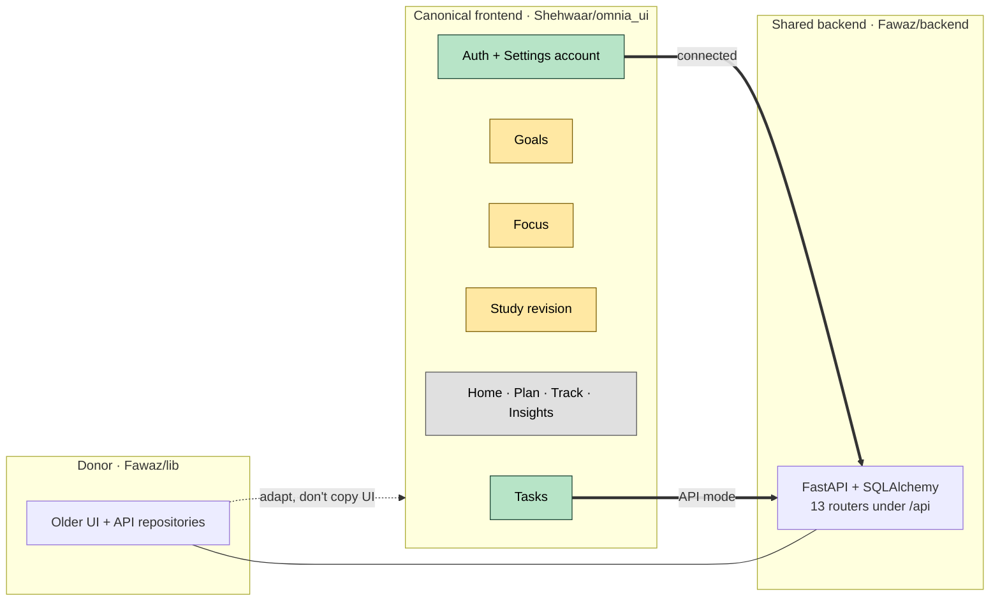

# OMNIA

OMNIA is a final-year team project: one Flutter app for study, tasks, long-term goals, focus, fitness and sleep, backed by a shared FastAPI backend. The long-term aim is **cross-domain planning**, where the app understands how these areas affect each other. That aim is product vision, not current behaviour. See [[AI Roadmap]].

This vault is the internal map of the project: architecture, reasoning, relationships and roadmap. The public-facing description lives in `Shehwaar/README.md`. This vault complements it and doesn't replace it.

> [!important] Two rules that the rest of the vault depends on
> 1. **`Shehwaar/omnia_ui` is the canonical frontend.** `Fawaz/lib` is a donor/reference implementation built on an older frontend. See [[Canonical Frontend]].
> 2. **"Backend has an endpoint" ≠ "frontend uses it".** Today only authentication and, in API mode, Tasks are connected. See [[Current Status]].

## Where to start

| If you want to know… | Open |
|---|---|
| What works today, and what is sample or local | [[Current Status]] |
| How the app is put together | [[Architecture Overview]] |
| How sign-in and sessions work | [[Authentication Flow]], [[Session Architecture]] |
| Which screen maps to which endpoint | [[Frontend Backend Integration]] |
| What Fawaz's code can offer | [[Fawaz Donor Map]] |
| What the backend exposes | [[API Map]] |
| Why things are the way they are | [[Architecture Decisions]] |
| What comes next | [[Roadmap]], [[Phase 5A - Profile and Daily Targets]] |
| Known problems and mismatches | [[Risks and Discrepancies]] |

## Map of the project

Green = API-connected · Yellow = works on local in-memory data · Grey = sample data.

## Feature notes

- Productivity: [[Tasks]] · [[Goals]] · [[Focus]] · [[Plan]]
- Learning: [[Study]]
- Body: [[Fitness and Activity]] · [[Sleep and Recovery]] · [[Nutrition]]
- Overview screens: [[Dashboard]] · [[Track]] · [[Insights]]
- Account & app: [[Settings]]
- Future: [[AI Assistant]] · [[Achievements and Life Timeline]]

## Other sections

- **Architecture:** [[Architecture Overview]] · [[Flutter Architecture]] · [[Repository Pattern]] · [[Mock vs API Mode]] · [[Session Architecture]] · [[Authentication Flow]] · [[Frontend Backend Integration]] · [[Fawaz Donor Map]]
- **Backend:** [[Backend Overview]] · [[API Map]]
- **Data models:** [[Data Model Overview]]
- **Decisions:** [[Architecture Decisions]]
- **Roadmap:** [[Roadmap]]
- **Development:** [[Running OMNIA]] · [[Testing]] · [[Git Checkpoints]] · [[Risks and Discrepancies]]

## Status vocabulary

The `status` property on feature notes uses these values everywhere in the vault:

| Value | Meaning |
|---|---|
| `api-connected` | The canonical frontend reads and writes this through FastAPI (API mode). |
| `local-functional` | Fully usable, but data lives in memory and is lost on restart. |
| `partial` | Some parts are real (live or local), some are sample content. |
| `sample` | UI exists and shows fixed sample data, labelled on screen. |
| `planned` | Not in the canonical frontend. It may exist in the backend or donor code. |

Other properties: `backend_available` (a backend module exists), `backend_connected` (the canonical frontend calls it), `donor` (Fawaz/lib has a usable implementation).
