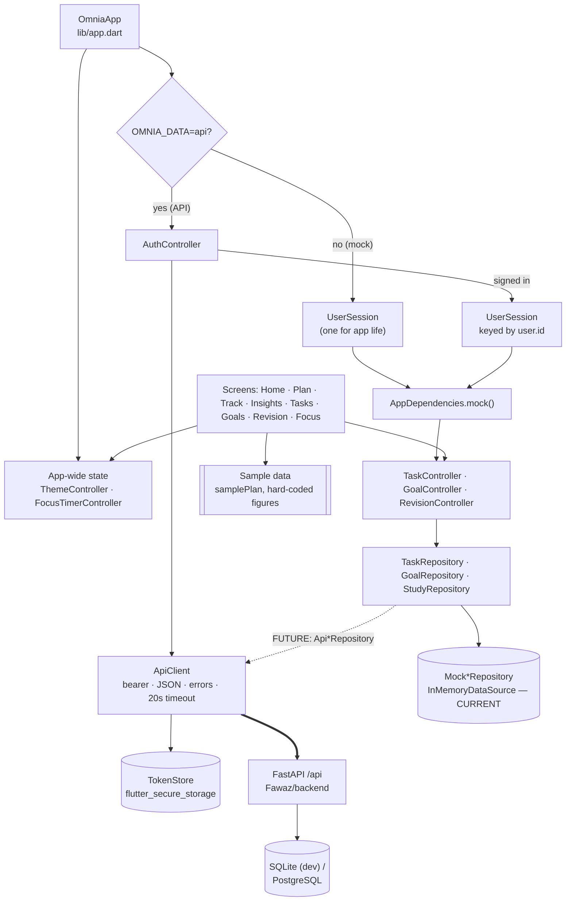

# Architecture Overview

OMNIA has three code bases in one repository. Only two of them make up the product:

| Part | Path | Role |
|---|---|---|
| Canonical Flutter frontend | `Shehwaar/omnia_ui` | **The app.** See [[Flutter Architecture]]. |
| Shared backend | `Fawaz/backend` | FastAPI + SQLAlchemy + Alembic. See [[Backend Overview]]. |
| Donor Flutter app | `Fawaz/lib` | Older, backend-connected frontend. It's a reference only. See [[Fawaz Donor Map]] and [[Canonical Frontend]]. |

## The real architecture today

Two separate flows run through the app:

1. **Auth flow (real in API mode):** `AuthController → ApiClient → FastAPI`. See [[Authentication Flow]].
2. **Feature flow (local):** `Screen → Controller → Repository interface → Mock repository`. See [[Repository Pattern]].

They meet in only one place: `AuthController` decides *which user* owns the current [[Session Architecture|UserSession]]. Feature repositories don't touch `ApiClient` yet. Closing that gap is the purpose of the [[Backend Integration Roadmap]], beginning with [[Phase 3 - Tasks API Integration]].

## Layering rules visible in the code

- Screens never call HTTP. `ApiClient` is "the only place the app talks HTTP" (`lib/core/api/api_client.dart`).
- Controllers depend on repository **interfaces**. Only `AppDependencies` chooses implementations (`lib/core/app_dependencies.dart`).
- Per-user state is created inside `UserSession` and destroyed with it. App-wide state lives above it. See [[App State vs User Session State]].
- There is no state-management package: it's `ChangeNotifier` + `InheritedNotifier` scopes.

## Related

- [[Mock vs API Mode]]: how the mode switch changes the tree
- [[Frontend Backend Integration]]: per-feature mapping to endpoints
- [[Data Model Overview]]: frontend and backend models side by side
- [[Architecture Decisions]]
- Up: [[00 - OMNIA|OMNIA]]
