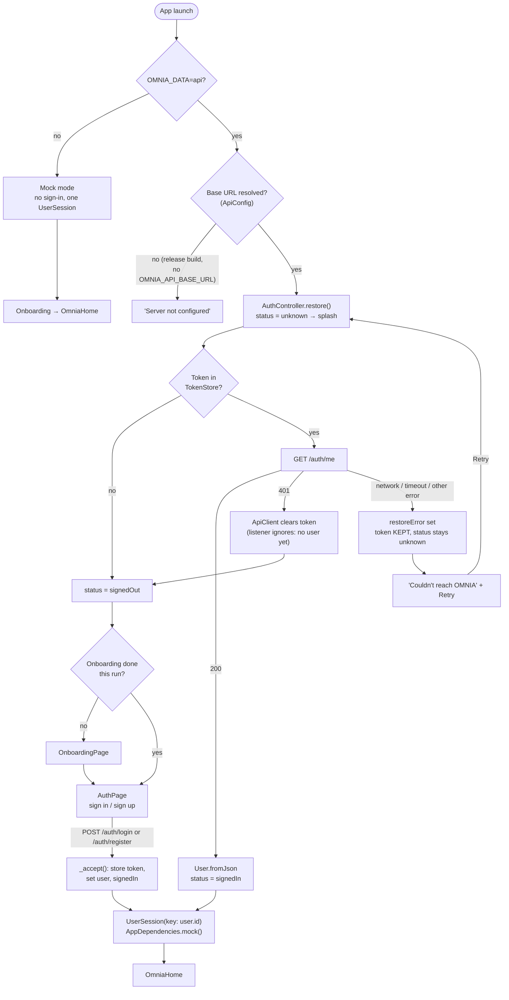
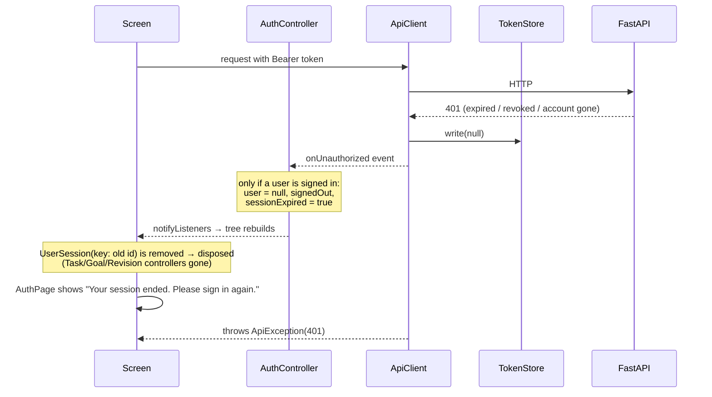

# Authentication Flow

Authentication is the **only** part of the canonical frontend connected to the backend. It runs in API mode only (see [[Mock vs API Mode]]). According to `Shehwaar/README.md`, it was verified manually against FastAPI on the Android emulator: register, sign in, account screen, sign out and in again, and session restore after restart.

**Code:** `lib/core/auth/auth_controller.dart`, `lib/core/api/api_client.dart`, `lib/core/auth/token_store.dart`, `lib/app.dart`, `lib/features/auth/auth_page.dart`, `lib/features/settings/settings_page.dart`.
**Backend:** [[Authentication API]]. **Model:** [[User]].

## Launch and restore

## Session expiry while signed in

Details that matter:

- **Only a token the client sent can expire.** A failed login is a plain 401 and doesn't fire `onUnauthorized` (`if (response.statusCode == 401 && token != null)`).
- **Several 401s at once sign out once.** Later events find `_user == null` and are ignored.
- **Wrong password is 403, not 401.** The backend's `WrongPasswordError` uses 403 for change-password and delete-account, so a typo doesn't end the session.
- **Offline restore keeps the token.** Only a 401 clears it.

## Account actions

| Action | Where | Call | Result |
|---|---|---|---|
| Register | `AuthPage` | `POST /auth/register` (`display_name`, `email`, `password`, `timezone`) | token + user → signed in |
| Sign in | `AuthPage` | `POST /auth/login` | token + user → signed in |
| Sign out | Settings | none (clears token locally) | signed out |
| Sign out everywhere | Settings | `POST /auth/logout-all` then local sign-out | backend bumps `token_version` |
| Change password | Settings | `POST /auth/change-password` | **new token** kept; other devices signed out |
| Delete account | Settings | `POST /auth/delete-account` (password) | local sign-out |

Client-side validation on registration: a name, an email format check and a password of at least 8 characters. Backend field errors map onto fields through `ApiException.fieldMessage()`. The time zone is pre-selected by `guessTimezone()` from the device's UTC offset.

## Token storage

`SecureTokenStore` uses `flutter_secure_storage` under key `omnia.access_token`. If the platform store throws, the token is kept **in memory only**, so the user has to sign in again after a restart. Tests use `MemoryTokenStore`.

## Worth knowing

- Since [[Phase 3 - Tasks API Integration]], task calls are routine authenticated calls, so an expired token surfaces during normal use: the 401 goes through `ApiClient.onUnauthorized` and back to sign-in once (tested with the fake backend and against a live backend).
- Backend tokens are JWTs that expire after 720 minutes by default. There is no refresh-token endpoint. See [[Risks and Discrepancies]].

## Related

[[Session Architecture]] · [[Frontend Backend Integration]] · [[Settings]] · [[App State vs User Session State]]
