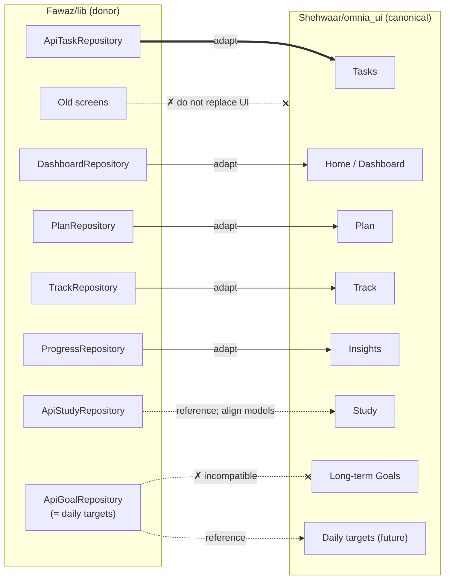

# Fawaz Donor Map

**Question answered here:** *What useful work already exists in `Fawaz/lib` that can be adapted into the canonical frontend?*

`Fawaz/lib` is a backend-connected Flutter app built from an **older version** of the OMNIA frontend. It's a donor and a reference, **not** the app. See [[Canonical Frontend]].

> [!important] Principle
> **Functionality and data integration can be reused. Old visual pages must not replace the newer canonical UI.** Port the repository and mapping logic, and rebuild screens in the canonical design system ([[Preserve OMNIA Design System]]).

## Classification

| Area | Donor files | Class | Why |
|---|---|---|---|
| API infrastructure | `core/api/api_client.dart`, `api_config.dart`, `api_exception.dart` | **Already adapted** | The canonical `ApiClient` is derived from it and improved: the timeout now covers reading the body, and there's a "token we sent" guard with comments. Don't re-copy. |
| Auth + token storage | `core/auth/auth_controller.dart`, `token_store.dart`, `timezones.dart` | **Already adapted** | Canonical versions exist (commit `70864a7`). |
| Session scoping | `core/session.dart` (`SessionScope`, `Loadable`, `ControllerScope`, `TabState`) | **REFERENCE** | A different state approach (generic `Loadable<T>` plus tab reload). The canonical `UserSession` covers the same need. |
| Tasks repository | `features/tasks/data/api_task_repository.dart` | **Already adapted** (Phase 3) | Implements the **identical** `TaskRepository` interface. `Task`, `TaskRepository` and `TaskController` are byte-identical apart from line endings. Adapted with import changes only (`asMap`/`parseDay`/`formatDay` from `core/api/json.dart`); the mapping is unchanged. |
| Tasks UI | `tasks_page.dart`, `task_form_page.dart` | **DO NOT COPY WHOLESALE** | The canonical Tasks UI is newer and has accessibility and hardening tests. |
| "Goals" repository | `features/goals/data/api_goal_repository.dart`, `goals/domain/goal.dart` | **INCOMPATIBLE** (with canonical Goals) | It's really **[[Daily Targets]]**: five fixed ids (`goal-study`, `goal-tasks`, …) read from `/dashboard` and written as `PATCH /profile`. Its `Goal` has no `completed` flag and no completion-only type, and `completed` is derived from `current >= target`. That contradicts [[Goals vs Daily Targets]]. It can serve as **REFERENCE** for a future daily-targets feature. |
| Daily-targets editor | `features/settings/goals_page.dart` | **REFERENCE** | Logic for editing profile targets. Rebuild it in the canonical Settings. |
| Dashboard | `features/home/data/dashboard_repository.dart`, `home/domain/dashboard.dart` | **Adapted** (Phase 4) | Trimmed to date, greeting, name, today's study/steps/sleep and next exam, so the donor's `Streaks`, `StudyBlock`, `DailyPlan` and task imports stayed out. The mapping moved to `dashboardFromApi` in `api_dashboard_repository.dart`, like `taskFromApi`. The donor `home_page.dart` UI is **DO NOT COPY**. |
| Plan | `features/plan/data/plan_repository.dart`, `domain/daily_plan.dart`, `plan_controller.dart` | **REUSE / ADAPT** (data), **REFERENCE** (UI) | Calls `GET`/`POST /ai/daily-plan` with regenerate and note. The canonical Plan has timeline and list views that must stay. |
| Revision | `features/plan/revision_controller.dart`, `revision_detail_page.dart` | **REFERENCE** | Built on the donor's backlog-topic study model (add topic, reset topics), not on the canonical embedded-`RevisionItem` model. |
| Focus | `features/plan/focus_session_page.dart` | **DO NOT COPY** | A per-page stopwatch that logs a study session when finished. The canonical [[Focus]] (app-wide Pomodoro, deadline-based, phase feedback) is more capable. Only the idea "log focus time to `/study/sessions`" is worth keeping. |
| Study | `features/study/data/api_study_repository.dart`, `domain/*`, `study_page.dart` | **REFERENCE** | A complete client for subjects, exams, backlog/revision topics, sessions and the 7-day plan. Its `StudyRepository` interface is **different** from the canonical one, so an adoption means model alignment first. See [[Study]]. |
| Track: activity, sleep, meals | `features/track/data/track_repository.dart`, `domain/wellbeing.dart`, `log_pages.dart`, `meals_page.dart` | **REUSE / ADAPT** (data), **REFERENCE** (UI) | Covers `/activity`, `/sleep`, `/meals` and `/nutrition/estimate`. The canonical Track screen layout stays. |
| Insights / progress | `features/insights/data/progress_repository.dart`, `domain/progress.dart` | **REUSE / ADAPT** (data) | `GET /progress?days=` and `GET /achievements`. |
| Social | `features/social/*` | **REFERENCE** | Full client and UI for friends, groups, chat, feed and challenges. No canonical feature exists yet, and it isn't on the near-term [[Roadmap]]. |
| Theme / widgets | `core/theme/*`, `core/widgets/*` | **DO NOT COPY** | These are older versions of the canonical design system. The canonical app has more components (`ActionRow`, `OmniaProgressBar`, `AccentCircle`) and dark-mode contrast work. |
| Onboarding | `features/onboarding/*` | **DO NOT COPY** | Older version of the canonical onboarding. |
| Tests | `Fawaz/test/*` (`api_client_test`, `tasks_test`, `onboarding_test`, `widget_test`, `support/`) | **REUSE / ADAPT** (test support) | `support/fake_backend.dart` answers `GET /tasks` and `POST /tasks` but has no per-task `PATCH`/`DELETE` routes. The canonical `test/support/fake_auth_backend.dart` now covers auth **and** `/tasks` (list with paging, create, get, patch, delete, user scoping, validation), written for Phase 3 against the real backend source. |

## Donor → canonical flow

## Related

[[Frontend Backend Integration]] · [[Canonical Frontend]] · [[Backend Integration Roadmap]] · [[Architecture Overview]]
