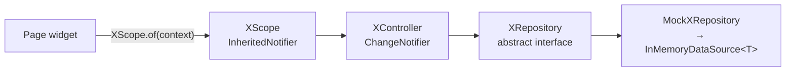

# Flutter Architecture

The structure of the canonical frontend, `Shehwaar/omnia_ui`. Part of [[Architecture Overview]].

## Stack

Flutter (Material 3), Dart `^3.13.4`. The runtime dependencies beyond Flutter are `http` (used by `ApiClient`) and `flutter_secure_storage` (used by `SecureTokenStore`). It uses no state-management, routing or DI package.

## Folder shape

```
lib/
├── main.dart                 runApp(OmniaApp)
├── app.dart                  modes, auth gate, sessions, bottom navigation
├── core/
│   ├── api/                  ApiClient, ApiConfig, ApiException, json helpers
│   ├── auth/                 AuthController + AuthScope, TokenStore, timezones
│   ├── data/                 InMemoryDataSource, MockData, RepositoryException
│   ├── models/               User, OmniaCategory
│   ├── theme/ widgets/       design system (see Preserve OMNIA Design System)
│   ├── app_dependencies.dart composition boundary
│   └── session.dart          UserSession (per-user state)
└── features/<feature>/       domain/ data/ controller, pages, widgets
```

Features live in `auth`, `focus`, `goals`, `home`, `insights`, `onboarding`, `plan`, `settings`, `study`, `tasks` and `track`.

## Recurring pattern



| Feature | Scope | Controller | Repository | Implementation |
|---|---|---|---|---|
| [[Tasks]] | `TaskScope` | `TaskController` | `TaskRepository` | `MockTaskRepository` (mock) · `ApiTaskRepository` (API mode) |
| [[Goals]] | `GoalScope` | `GoalController` | `GoalRepository` | `MockGoalRepository` |
| [[Study]] | `RevisionScope` | `RevisionController` | `StudyRepository` | `MockStudyRepository` |
| [[Focus]] | `FocusTimerScope` | `FocusTimerController` | none | none (in memory) |
| Auth | `AuthScope` | `AuthController` | none (uses `ApiClient`) | FastAPI |
| Theme | `ThemeScope` | `ThemeController` | none | none |

`TaskController` and `GoalController` share the same shape: `load()`, mutations that return `Future<bool>` instead of throwing, and a per-id `_busy` set that ignores double taps. The code carries a `ponytail:` note to extract a shared base only if a third feature needs it.

`RevisionController` differs: it updates optimistically, saves, and **reverts on failure**, then rethrows. See [[Risks and Discrepancies]].

## Navigation

`OmniaHome` holds four tabs in an `IndexedStack`: **Home · Plan · Track · Insights**. Everything else is pushed with `Navigator.push`:

- Home → Settings (app-bar button), Tasks (Tasks card), Goals (Goals preview), Revision (agenda item)
- Plan → Revision (revision items), Focus Timer (`FocusTimerEntry`)
- Revision → Focus Timer ("Start Focus Session")

`UserSession` and the app-wide scopes sit **above** `MaterialApp`, so pushed routes can reach them.

## Onboarding

A multi-page intro with skip, back and swipe. Completion is an in-memory flag in `_OmniaAppState` (`_onboardingComplete`), so it shows again on every cold start in mock mode. A comment in `app.dart` marks where persistence would go. In API mode a signed-in user skips it.

## Related

- [[Repository Pattern]] · [[Session Architecture]] · [[Mock vs API Mode]]
- [[Preserve OMNIA Design System]]
- [[Testing]]
