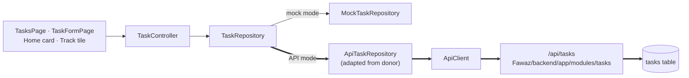

# Frontend Backend Integration

The central mapping note: for each canonical feature, it traces **controller → repository interface → current implementation → Fawaz donor → backend module**. Every row was checked against source. "—" means the relationship doesn't exist; it has not been left out for convenience.

Legend: **CURRENT** = what runs today · **DONOR** = exists in `Fawaz/lib` · **BACKEND** = exists in `Fawaz/backend`.

## Map

| Canonical feature | Controller (canonical) | Repository interface | CURRENT implementation | DONOR implementation | BACKEND | Connected? |
|---|---|---|---|---|---|---|
| [[Authentication Flow\|Auth]] | `AuthController` | — (uses `ApiClient`) | `ApiClient` → FastAPI | `core/auth/auth_controller.dart` (already adapted) | [[Authentication API]] | ✅ API mode |
| [[Tasks]] | `TaskController` | `TaskRepository` | `ApiTaskRepository` (API mode) · `MockTaskRepository` (mock mode) | `ApiTaskRepository` (adapted) | [[Tasks API]] | ✅ API mode (Phase 3, verified) |
| [[Goals]] (long-term) | `GoalController` | `GoalRepository` | `MockGoalRepository` | ⚠️ `ApiGoalRepository` is **[[Daily Targets]]**, not long-term goals | — none | ❌ needs new module |
| [[Daily Targets]] | `AuthController.updateProfile` (edit) · `DashboardController` (display) | — (profile is account data on `AuthController`) | `PATCH /profile`, then a dashboard reload | `settings/goals_page.dart` (reference) | [[Profile and Dashboard API]] (`/profile`, `/dashboard`) | ✅ API mode (Phase 5A, verified) |
| [[Study]] (revision session) | `RevisionController` | `StudyRepository` (5 methods, session-centred) | `MockStudyRepository` | `ApiStudyRepository` — **different, larger interface** (subjects, exams, topics, sessions, plan) | [[Study API]] | ❌ model alignment needed |
| [[Focus]] | `FocusTimerController` | — | local | `plan/focus_session_page.dart` (stopwatch that logs a study session) | `POST /study/sessions` (logging only) | ❌ optional |
| [[Dashboard]] (Home) | `DashboardController` (+ `TaskScope`, `GoalScope`, `RevisionScope`) | `DashboardRepository` | `ApiDashboardRepository` (API mode) · `MockDashboardRepository` (mock mode) | `home/data/dashboard_repository.dart` (adapted) | `GET /dashboard` | ✅ API mode (Phase 4, verified) |
| [[Plan]] | none (`samplePlan` const) | — | sample | `plan/data/plan_repository.dart`, `PlanController` | [[AI API]] `/ai/daily-plan` | ❌ |
| [[Track]] | `DashboardController` (shared with Home) + `TaskScope` + `TrackController` (logging) | `DashboardRepository`, `TrackRepository` | summary tiles as Home; `ApiTrackRepository` (API mode) · `MockTrackRepository` (mock mode) for today's activity and sleep; "Today's activity" list sample | `track/data/track_repository.dart` | `GET /dashboard`; logging: [[Activity API]], [[Sleep API]], [[Nutrition API]] | 🟡 tiles only |
| [[Insights]] | none | — | sample | `insights/data/progress_repository.dart` | [[Progress API]] | ❌ |
| [[Settings]] | `ThemeController`, `AuthController` | — | theme local; account and profile → FastAPI | `settings/settings_page.dart`, `settings/goals_page.dart` (reference) | [[Authentication API]], [[Profile and Dashboard API]] | ✅ account section + profile editor |
| Social | — (no feature) | — | — | `social/data/social_repository.dart` + pages | [[Social API]] | ❌ |
| Calendar feed / data export | — | — | — | — (not called by donor repos) | [[Integrations API]] | ❌ |

## The Tasks path (Phase 3)

Details: [[Phase 3 - Tasks API Integration]].

## Why some rows can't simply be "switched on"

- **Goals:** the backend has no long-term goals. The donor's `ApiGoalRepository` presents the five profile targets (study, tasks, steps, sleep, kcal) as "goals" read from `/dashboard` and written with `PATCH /profile`. Wiring it into the canonical `GoalRepository` would silently swap the concept. See [[Goals vs Daily Targets]].
- **Study:** the canonical `StudySession` embeds a list of `RevisionItem`s. The backend's `StudySession` is a *logged block of time* (minutes, date, optional backlog item), and revision topics are separate `BacklogItem`s with `kind = revision`. See [[Study Session]].
- **Plan:** the canonical screen has no controller or domain model for this data yet. That work is new UI wiring inside the existing design, not a repository swap. (Dashboard got its model and controller in [[Phase 4 - Dashboard API Integration]].)

## Related

[[Architecture Overview]] · [[Fawaz Donor Map]] · [[API Map]] · [[Backend Integration Roadmap]] · [[Data Model Overview]]
