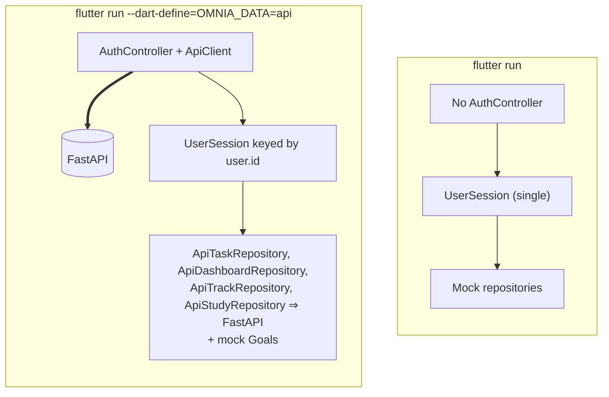

# Mock vs API Mode

The canonical frontend has two data modes, chosen at build time with a `--dart-define`.

| | Mock mode (default) | API mode |
|---|---|---|
| Command | `flutter run` | `flutter run --dart-define=OMNIA_DATA=api` |
| Decided by | `ApiConfig.apiMode == false` | `String.fromEnvironment('OMNIA_DATA') == 'api'` |
| Sign-in | None | Real FastAPI accounts ([[Authentication Flow]]) |
| Backend needed | No | Yes |
| `UserSession` | One for app life | One per signed-in user ([[Session Architecture]]) |
| Tasks | In-memory mock | **FastAPI `/tasks`** via `ApiTaskRepository` (user-scoped) |
| Goals | In-memory mock with sample goals | **In-memory, starts empty** per user; the screen says it isn't synced |
| Study | Sample subject, exam and revision session | **FastAPI `/study/subjects`, `/study/exams`** via `ApiStudyRepository`; the demo revision session is hidden |
| Today / Areas day summary | Sample day (`MockDashboardRepository`) | **FastAPI `/dashboard`** via `ApiDashboardRepository` (user-scoped) |
| Activity and sleep logging | `MockTrackRepository`, shared with the mock dashboard so a mock log shows on Home | **FastAPI `/activity/{day}`, `/sleep/{day}`** via `ApiTrackRepository` |
| Plan, Insights, Today "Next up" / "Why?" | Sample data (labelled) | **Empty states**: no sample data is ever shown (`AppDependencies.sampleContent` is false) |
| Focus | App-wide, local | App-wide, local |
| Settings → Account | Hidden | Shown when signed in |
| Typical use | UI work, demos, automated tests | Auth and integration work |

> [!warning] API mode is not "backend mode" yet
> Today it means *real accounts + server-backed Tasks, profile, day summary and activity/sleep logs + local Goals and Focus + honest empty states for everything else*. Each feature moves to the backend in its own phase. See [[Mock First API Migration]] and [[Backend Integration Roadmap]].

## Visual

## Backend URL (`ApiConfig.resolveBaseUrl`)

| Situation | URL |
|---|---|
| `--dart-define=OMNIA_API_BASE_URL=<url>` (or the older `API_BASE_URL`) | that URL (trailing `/` removed) |
| Debug, Android emulator | `http://10.0.2.2:8000/api` (the emulator's alias for the host) |
| Debug, web / iOS / desktop | `http://localhost:8000/api` |
| Release without `OMNIA_API_BASE_URL` | `null` → "Server not configured" screen |

Plain `http://` is allowed only in **debug** Android builds (`usesCleartextTraffic` in the debug manifest).

## Running against any backend

`Shehwaar/omnia_ui/integration/` holds the portable setup: `README.md` (modes, settings, commands, per-platform notes), `API_CONTRACT.md` (every endpoint the frontend calls and the JSON it expects), `COMPATIBILITY.md` (a checklist for a new backend), `omnia.env.example` (for `--dart-define-from-file`) and `run_frontend.ps1`.

## The target state after migration

Mock mode stays permanently: tests and UI work depend on it. In API mode, each repository in `AppDependencies` is swapped for its API version as that feature's phase finishes, starting with [[Tasks]].

## Related

[[Running OMNIA]] · [[Repository Pattern]] · [[Current Status]]
