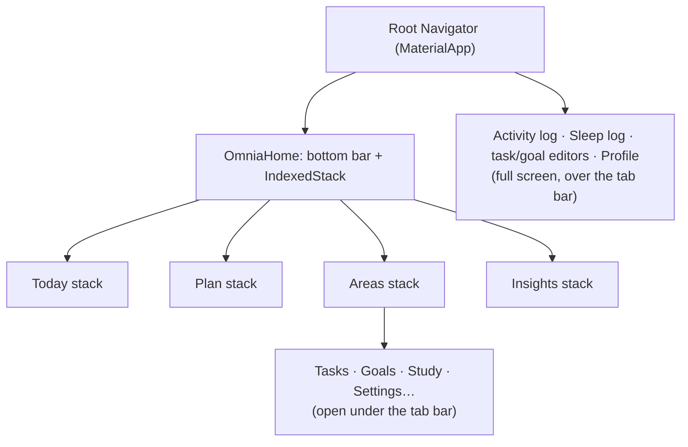

# Navigation and Information Architecture

How the canonical app is organised and how screens open. Verified against the working tree after [[Phase 5B - Activity and Sleep Logging]] (UX architecture pass, uncommitted). Back to [[00 - OMNIA|OMNIA]].

## The four questions

| Tab | Answers | Code |
|---|---|---|
| **Today** | What matters now? A summary and router, not a directory. | `features/home/home_page.dart` (class still `HomePage`) |
| **Plan** | What am I doing, and when? | `features/plan/plan_page.dart` |
| **Areas** | What parts of my life do I manage? | `features/areas/areas_page.dart` |
| **Insights** | What patterns exist over time? | `features/insights/insights_page.dart` |

The tabs are one `RootTab` enum in `lib/app.dart`; renaming a tab (e.g. "Areas") is a one-line change. AI is meant to be a layer across all four, not a tab. None of it exists yet: see [[AI Assistant]].

## Stacks and back behaviour

- Each tab has its **own `Navigator`**, so an area's screens open under the bottom bar and each tab is kept where it was left.
- **Forms and editors** use the root navigator (`Navigator.of(context, rootNavigator: true)`) and cover the tab bar.
- System back pops the visible tab's stack first (`NavigatorPopHandler`, enabled only for the visible tab), then leaves the app.
- Tapping the active tab returns it to its first screen.
- Controllers stay session-owned above the navigators ([[Session Architecture]]), so no state is lost by moving between tabs. The Focus timer is app-wide and keeps running.

## Where things open

Each destination owns a static `open(context)` (`TasksPage.open`, `GoalsPage.open`, `StudyPage.open`, `ActivityLogPage.open`, `SleepLogPage.open`), so Today and Areas always go to the same place.

| From | Tap | Opens |
|---|---|---|
| Today | Study card | Study (in the Today tab) |
| Today | Tasks card | Tasks |
| Today | Activity / Sleep card | Today's activity log / last night's sleep log (full screen) |
| Today | Goals preview | Goals |
| Today | Exam card "Open Study" (API mode, exam present) | Study |
| Areas | Study · Tasks · Goals · Activity · Sleep | the same destinations |

A card goes to the thing it represents; nothing switches tabs behind the user's back.

## Real data only

In API mode (`AppDependencies.sampleContent == false`) no screen shows demo data. What exists is shown; what doesn't gets an empty state:

| Screen | API mode today |
|---|---|
| Today | Real greeting, date, exam, Study/Activity/Sleep figures, tasks and goals. **Next up: "No plan yet."** No "Why?" dialog. |
| Plan | Server date, **"No plan yet."**, the Focus timer entry. No timeline until Phase 5C (daily plan; see [[Plan]]). |
| Areas | Real tiles only (see [[Areas]]). |
| Insights | "No insights yet". Nothing computed. |
| Goals | Starts empty; says it isn't synced ([[Goals]] are still local-only). |
| Study | Dashboard study minutes, next exam or "No exams coming up.", Focus timer. The demo revision session is not shown. |

Mock mode keeps the labelled sample day for development and tests. See [[Mock vs API Mode]].

## Input rule: pick, don't type

**Known finite choice → selection control. Arbitrary value → input.**

| Picked | Control |
|---|---|
| Workout type (presets + Other, custom values preserved), sleep quality, task/goal category, preferred workout time | `SelectField` (sheet of options) |
| Time zone (sign-up, Profile) | `SelectField` with search |
| Task estimated time | presets (15m–2h) + Custom minutes; a non-preset value opens as Custom |
| Task priority, goal tracking type, Focus timer | `ChoiceSegments`: segments, or a list at large text sizes |
| Dates and times | `PickerField` + platform date/time pickers |

Still typed, because they are arbitrary: titles, descriptions, names, username, email/password, exact numbers (steps, minutes, sleep hours/minutes, goal values, daily targets), a custom workout name, goal unit.

## Visual system

See [[Preserve OMNIA Design System]] for typography (Archivo + Space Mono) and the shared components.

## Current limitations

- **Plan** has no real plan until Phase 5C (daily plan; see [[Plan]]) connects `/ai/daily-plan`.
- **Goals** are local-only in API mode (in memory, cleared when OMNIA closes).
- **Study** is limited to the dashboard's figures and the Focus timer; no subjects, exams or sessions of its own yet.
- **Insights** shows no real insights yet.

Related: [[Flutter Architecture]] · [[Current Status]] · [[Areas]] · [[Dashboard]]
