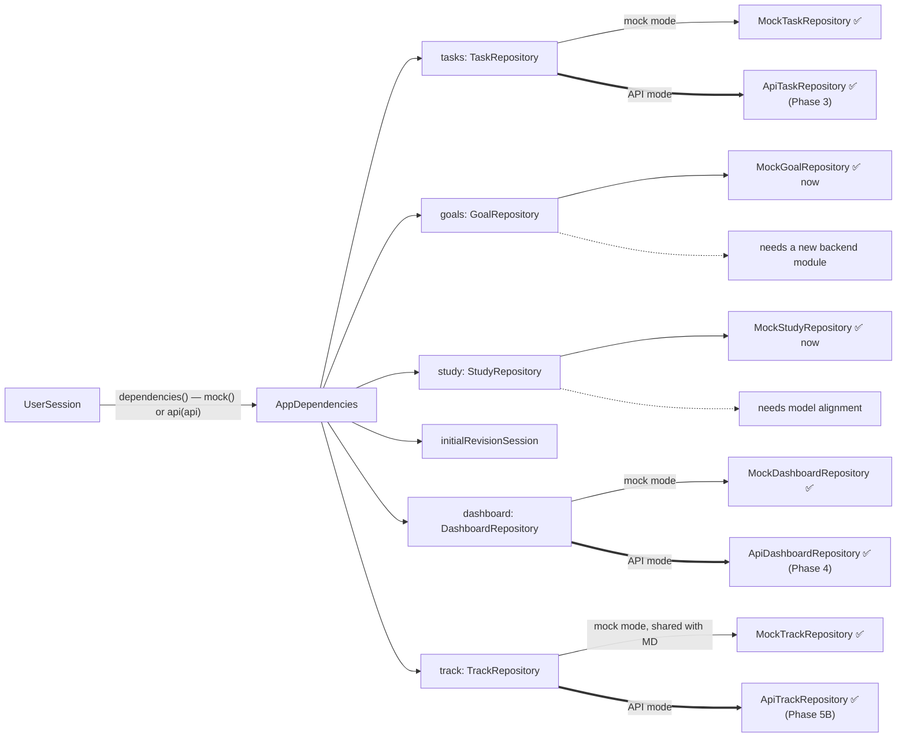

# Repository Pattern

Controllers talk to **repository interfaces**. A single composition point, `AppDependencies`, decides which implementation each interface gets. This seam is what makes the [[Mock First API Migration]] possible.

## Interfaces in the canonical frontend

| Interface | Methods | Current implementation | Model |
|---|---|---|---|
| `TaskRepository` | `getTasks`, `getTask`, `createTask`, `updateTask`, `setCompleted`, `deleteTask` | `MockTaskRepository` (mock) · `ApiTaskRepository` (API mode) | [[Task]] |
| `GoalRepository` | `getGoals`, `getGoal`, `createGoal`, `updateGoal`, `setCompleted`, `deleteGoal` | `MockGoalRepository` | [[Goal]] |
| `StudyRepository` | `getSubjects`, `getExams`, `getSessions`, `getSession`, `updateSession` | `MockStudyRepository` | [[Study Session]] |
| `TrackRepository` | `getActivity`, `saveActivity`, `getSleep`, `saveSleep`, `deleteSleep` (whole-day PUTs) | `MockTrackRepository` (mock; the mock dashboard reads the same instance) · `ApiTrackRepository` (API mode) | `ActivityDay`, `SleepEntry` |
| `DashboardRepository` | `getDashboard` (read-only) | `MockDashboardRepository` (mock) · `ApiDashboardRepository` (API mode) | `Dashboard` (date, greeting, name, today's study/steps/sleep vs targets, next exam) |

The Task and Goal interfaces carry the same contract comment: *"IDs are supplied by the caller for now. Always use returned entities: a future API may assign a canonical ID or normalize other fields on creation."* The controllers already honour it. `TaskController.create` stores the entity the repository **returns**, not the one it sent, which is exactly what a server-assigned UUID needs.

## Mock implementations

All mock repositories wrap `InMemoryDataSource<T>` (`lib/core/data/in_memory_data_source.dart`):

- A `Map<String, T>` seeded from `MockData`.
- `RepositoryException(notFound | duplicateId | invalidReference)` on bad ids.
- Returns unmodifiable lists. Models are immutable.
- **No persistence.** Everything is lost on restart, and in API mode on sign-out.

`MockStudyRepository` also validates references (an exam belongs to the session's subject).

## Composition

There are two factories. `AppDependencies.mock()` builds all-mock repositories; `AppDependencies.api(ApiClient)` uses `ApiTaskRepository` and `ApiDashboardRepository` and keeps mock Goals and Study. `UserSession` takes a factory and calls it **once** when the session starts. `app.dart` passes mock in mock mode and `api(api)` once signed in. `OmniaApp`'s optional `dependencies` override (used by tests) wins in both modes.

## How Phase 3 added the first API implementation

In [[Phase 3 - Tasks API Integration]]:

- `ApiTaskRepository(ApiClient)`: the donor version, which fits the canonical `TaskRepository` interface unchanged (imports switched to `core/api/json.dart`). See [[Fawaz Donor Map]].
- `AppDependencies.api(api)` beside `mock()`, chosen in `app.dart` when `auth != null`, built per session through `UserSession`'s factory.
- Error mapping: API failures throw `ApiException`, and the controllers already turn any exception into `false` or `loadError`.

[[Phase 4 - Dashboard API Integration]] added the second, read-only one: `ApiDashboardRepository` (`GET /dashboard`, mapped by `dashboardFromApi`) beside `MockDashboardRepository`, whose sample day used to be hard-coded in the Home and Track widgets.

## Related

[[Flutter Architecture]] · [[Mock vs API Mode]] · [[Session Architecture]] · [[Tasks]] · [[Goals]] · [[Study]]
