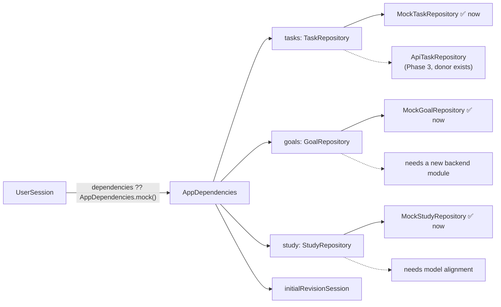

# Repository Pattern

Controllers talk to **repository interfaces**. A single composition point, `AppDependencies`, decides which implementation each interface gets. This seam is what makes the [[Mock First API Migration]] possible.

## Interfaces in the canonical frontend

| Interface | Methods | Current implementation | Model |
|---|---|---|---|
| `TaskRepository` | `getTasks`, `getTask`, `createTask`, `updateTask`, `setCompleted`, `deleteTask` | `MockTaskRepository` | [[Task]] |
| `GoalRepository` | `getGoals`, `getGoal`, `createGoal`, `updateGoal`, `setCompleted`, `deleteGoal` | `MockGoalRepository` | [[Goal]] |
| `StudyRepository` | `getSubjects`, `getExams`, `getSessions`, `getSession`, `updateSession` | `MockStudyRepository` | [[Study Session]] |

The Task and Goal interfaces carry the same contract comment: *"IDs are supplied by the caller for now. Always use returned entities: a future API may assign a canonical ID or normalize other fields on creation."* The controllers already honour it. `TaskController.create` stores the entity the repository **returns**, not the one it sent, which is exactly what a server-assigned UUID needs.

## Mock implementations

All mock repositories wrap `InMemoryDataSource<T>` (`lib/core/data/in_memory_data_source.dart`):

- A `Map<String, T>` seeded from `MockData`.
- `RepositoryException(notFound | duplicateId | invalidReference)` on bad ids.
- Returns unmodifiable lists. Models are immutable.
- **No persistence.** Everything is lost on restart, and in API mode on sign-out.

`MockStudyRepository` also validates references (an exam belongs to the session's subject).

## Composition

`AppDependencies.mock()` is the only factory today. `OmniaApp` accepts an optional `dependencies` override, which tests use. In API mode nothing passes one, so every session falls back to mocks.

## What an API implementation will need

For [[Phase 3 - Tasks API Integration]]:

- An `ApiTaskRepository(ApiClient)`. The donor version fits the canonical `TaskRepository` interface **unchanged**; the interface files are identical. See [[Fawaz Donor Map]].
- A way to build per-session `AppDependencies` that holds the app-wide `ApiClient`, for example a factory beside `mock()`, chosen in `app.dart` when `auth != null`.
- Error mapping: API failures throw `ApiException`, and the controllers already turn any exception into `false` or `loadError`.

## Related

[[Flutter Architecture]] · [[Mock vs API Mode]] · [[Session Architecture]] · [[Tasks]] · [[Goals]] · [[Study]]
