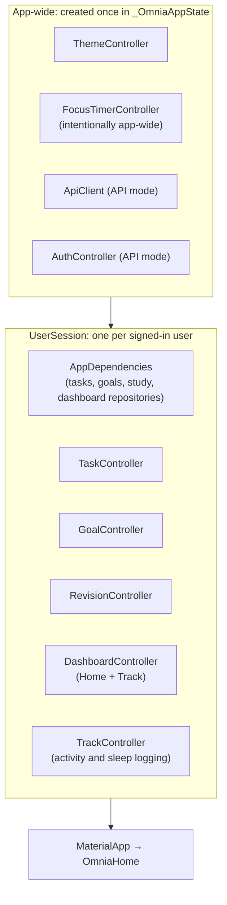

# Session Architecture

How the canonical frontend separates **app-wide** state from **per-user** state. The decision behind it is recorded in [[App State vs User Session State]].

**Code:** `lib/core/session.dart` (`UserSession`), `lib/app.dart` (`_OmniaAppState`).

## The two layers

| App-wide | Per user (`UserSession`) |
|---|---|
| `ThemeController` | `AppDependencies` |
| `FocusTimerController` | `TaskController` (`..load()` on creation) |
| `ApiClient` | `GoalController` (`..load()` on creation) |
| `AuthController` | `RevisionController` |
| | `DashboardController` (`..load()` on creation, again on app resume) |
| | `TrackController` (holds no figures; reloads the session's `DashboardController` after each stored change) |

## Lifecycle

- **Mock mode:** one `UserSession` for the life of the app.
- **API mode:** `UserSession(key: ValueKey(user.id))`. Sign-out, session expiry or switching accounts removes the widget, and `dispose()` tears down its controllers. The next user gets new `AppDependencies` from the session factory: server-backed Tasks for that account, and **fresh in-memory data** for Goals and Study.

This guarantees that one user's local data can't carry over into another user's session. Since [[Phase 3 - Tasks API Integration]], the same boundary makes sure user B never sees user A's cached tasks (tested); the backend scopes the stored tasks themselves.

## Why Focus is not per user

The Focus timer is deliberately app-wide: a running countdown shouldn't reset when a screen changes, and `FocusPhaseFeedback` (wrapped around every route in `MaterialApp.builder`) has to feel the phase end on any screen. A side effect is that a running timer **survives sign-out and a change of user**. At the current stage that's accepted. See [[Focus]].

## Placement detail

`UserSession` wraps `MaterialApp` (`_session(home) → UserSession(child: _app(home))`), so every pushed route (Tasks, Goals, Revision, Focus) can reach the session scopes.

## Related

[[Authentication Flow]] · [[Repository Pattern]] · [[Mock vs API Mode]] · [[Flutter Architecture]]
