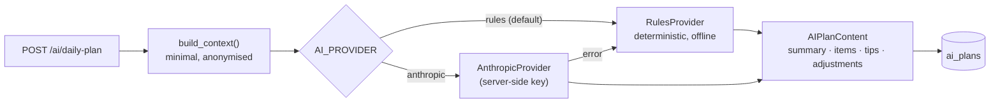

# AI API

`modules/ai` · prefix `/api/ai`. Table `ai_plans` (one JSON `content` per plan, plus `source`, `is_fallback` and `fallback_reason`).

| Endpoint | Behaviour |
|---|---|
| `POST /ai/daily-plan` `{regenerate?, note?}` | Returns today's existing plan (**200**) unless `regenerate`, otherwise generates one (**201**). Only actual generation is rate limited (default 20/hour per user). |
| `GET /ai/daily-plan?date=` | The latest plan for a date (default today) |

## Providers (`providers.py`)

- **Context** (`context.py`): the [[Daily Targets]], preferred workout time, today's and yesterday's stats, streaks, upcoming exams, today's study blocks, open task titles as refs (`t1`, `t2`…, mapped back on the server), last night's sleep and the optional note. Email, name, ids, task notes and history beyond yesterday are never sent.
- **Output:** a `summary`, up to 20 time-boxed `items` (sorted, non-overlapping, each with a category and an optional task or subject link), up to 5 `tips` and up to 6 `adjustments` ("what changed").
- **The rules provider** already reacts to exam proximity and to short or poor sleep or a "tired" note.

> [!caution]
> This is plan generation only. There's no chat, no memory and no cross-module learning. The canonical frontend doesn't call it. See [[AI Assistant]] and [[AI Roadmap]].

The configured model name is a server setting (`AI_MODEL`) and doesn't concern the app.

Related: [[Plan]] · [[API Map]] · [[Nutrition API]] (photo estimator uses the same provider setting)
