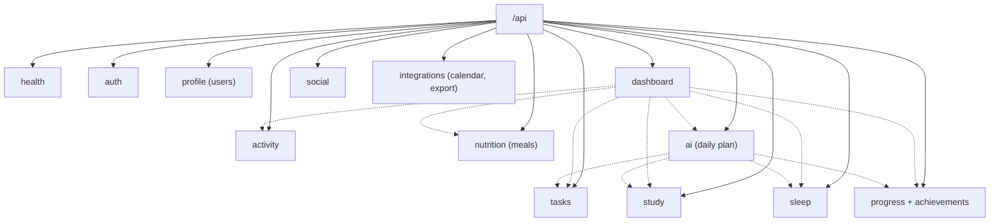

# Backend Overview

The shared team backend at `Fawaz/backend`. It serves both the canonical frontend (auth only, today) and the donor app. Part of [[Architecture Overview]].

## Stack

FastAPI + Uvicorn · SQLAlchemy 2 · Alembic · Pydantic · PyJWT · SQLite by default in development (`sqlite:///./omnia.db`) · PostgreSQL in production and Docker Compose. `app/main.py` reports API version `0.2.0`.

## Structure

```
app/
├── main.py            create_app(): middleware, CORS, error handlers, /api router
├── core/              config, security (scrypt + JWT), errors, logging, rate_limit, time
├── common/            deps (DbSession, CurrentUser), ownership, schemas (InputModel, PatchModel, Page)
├── db/                Base, IdMixin, TimestampMixin, UTCDateTime, session
├── models.py          imports every model for Alembic
├── modules/<name>/    router.py · schemas.py · service.py · models.py
└── scripts/seed.py    fictional demo data
alembic/versions/      0001 initial · 0002 sleep+meals · 0003 social · 0004 calendar feeds
tests/                 pytest, one file per area
scripts/integration_check.py   end-to-end check incl. restart
```

## Modules



Dotted arrows show service-level reads, taken from the imports. `dashboard` aggregates activity, AI plan, nutrition, progress, sleep, study and tasks. `ai/context.py` reads progress (which covers daily facts, including activity), sleep, study, tasks and the profile.

Notes per module: [[Authentication API]] · [[Profile and Dashboard API]] · [[Tasks API]] · [[Study API]] · [[Activity API]] · [[Sleep API]] · [[Nutrition API]] · [[Progress API]] · [[Social API]] · [[Integrations API]] · [[AI API]]. Full endpoint list: [[API Map]].

## Cross-cutting behaviour (verified in source)

- **Ownership:** the user id always comes from the token. Another user's resource answers **404** (`common/ownership.py`).
- **Strict input:** `InputModel` uses `extra="forbid"`, so unknown fields such as `user_id` are rejected. `PatchModel` separates "omitted" from explicit `null` and refuses `null` on `non_nullable` fields.
- **Errors:** one envelope, `{"error": {code, message, details[]}}`. The canonical `ApiException` parses it.
- **Auth:** scrypt password hashes. JWT access tokens (default 720 min) carry `token_version`, which password change and logout-all bump.
- **Rate limits:** in-memory sliding window. Auth defaults to 10/min, AI to 20/hour.
- **Time zones:** "today" is computed in the profile's time zone (`local_today`).
- **Dev conveniences:** OpenAPI docs at `/api/docs` outside production. CORS allows any `localhost` port in development. An empty `AUTH_SECRET` in development falls back to a random per-process secret, so every restart invalidates tokens.

## Data model

See [[Data Model Overview]]. Tables: `users`, `profiles`, `tasks`, `subjects`, `exams`, `backlog_items`, `study_sessions`, `activity_days`, `sleep_logs`, `meals`, `ai_plans`, `calendar_feeds`, and the social tables.

## Related

[[Running OMNIA]] · [[Testing]] · [[Frontend Backend Integration]] · up: [[00 - OMNIA|OMNIA]]
