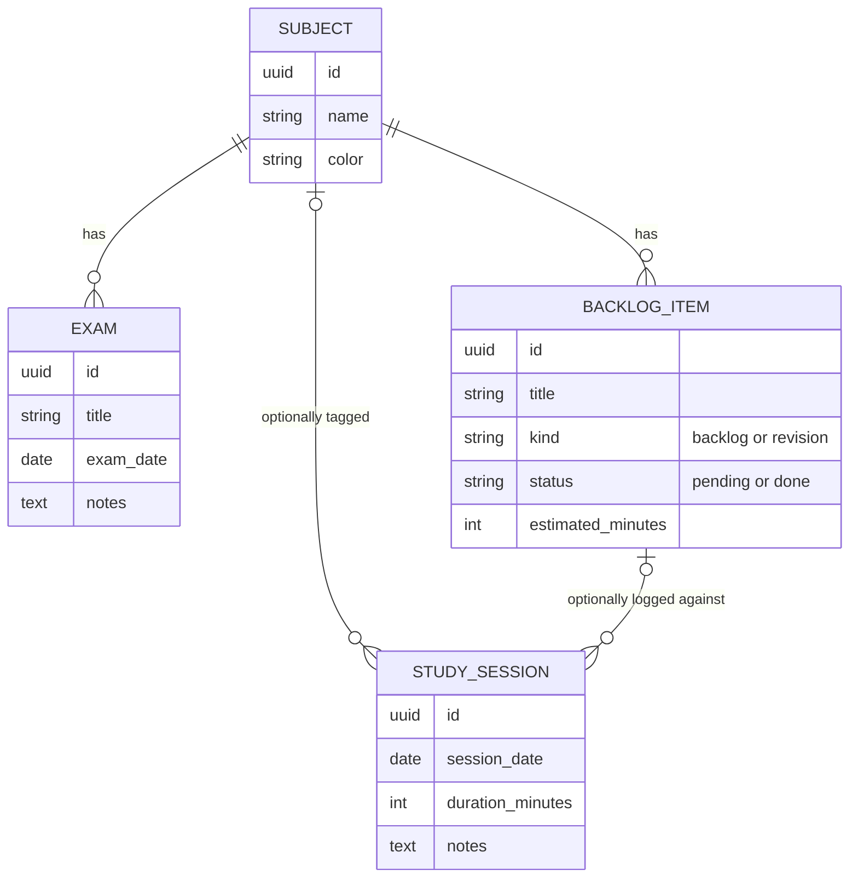

# Study API

`Fawaz/backend/app/modules/study` · prefix `/api/study`. It's the backend counterpart to [[Study]], but its model is **different** from the canonical one. See [[Study Session]].

## Entities

## Endpoints

| Area | Endpoints | Notes |
|---|---|---|
| Subjects | `GET/POST /study/subjects`, `PATCH/DELETE /study/subjects/{id}` | Deleting a subject removes its exams and backlog. Sessions are kept, unlinked. |
| Exams | `GET/POST /study/exams` (`include_past`), `PATCH/DELETE /study/exams/{id}` | `ExamOut.days_left` |
| Backlog / revision topics | `GET/POST /study/backlog` (`status`, `subject_id`), `PATCH/DELETE /study/backlog/{id}` | `kind`: `backlog` or `revision`. `estimated_minutes` 5–600. |
| Sessions (time logged) | `GET/POST /study/sessions` (`from`, `to`, ≤1 year), `DELETE /study/sessions/{id}` | `complete_backlog_item` can mark the linked topic done |
| Plan | `GET /study/plan?days=1..28` | Rule-based allocation (`planner.py`) scored by exam proximity with per-subject caps. Returns `PlanDay`s of `PlanBlock`s with a `reason`. |

## Relevance to the canonical frontend

- Revision checklist items ↔ `BacklogItem(kind=revision)` is the likely mapping. It needs a decision, because the canonical items are embedded in a session.
- [[Focus]] minutes ↔ `POST /study/sessions` is a natural optional link.
- Study minutes feed the dashboard, streaks, achievements and the AI plan.
- There are **no** flashcards, quizzes, mastery scores or test results in this module. Those belong to the [[Adaptive Learning Roadmap]].

Related: [[API Map]] · [[Fawaz Donor Map]] (`ApiStudyRepository`)
