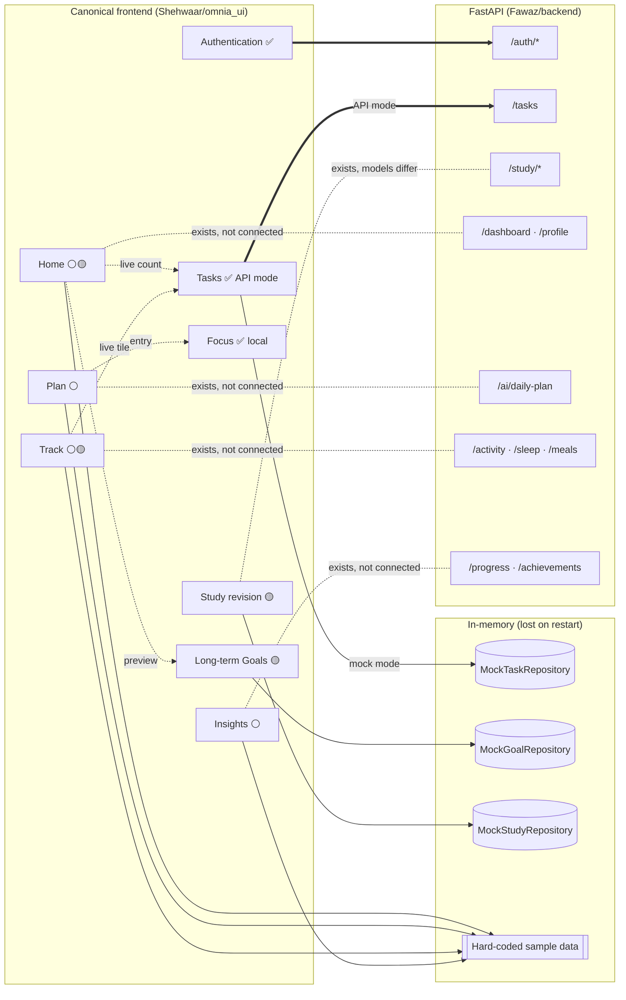

# Current Status

A snapshot verified against the source, not against the README. Back to [[00 - OMNIA|OMNIA]].

> [!summary] In one line
> **In API mode, authentication and Tasks are real (FastAPI); every other feature's data is still local.** In mock mode, nothing talks to a server.
>
> Phase 3 (Tasks) is complete: automated verification passed and it was manually verified on the Android emulator against the real backend.

## Feature integration map

Thick arrow = wired today. Dotted arrows to the backend = the backend endpoint exists, but the canonical frontend doesn't call it.

## Status table

| Area | Status | Data source today | Backend support | Note |
|---|---|---|---|---|
| [[Authentication Flow\|Authentication]] | `api-connected` | FastAPI `/auth/*` | [[Authentication API]] | Manually verified on the Android emulator (per README) |
| [[Tasks]] | `api-connected` (API mode) | `ApiTaskRepository` (API mode) · `MockTaskRepository` (mock mode) | [[Tasks API]] full CRUD | [[Phase 3 - Tasks API Integration]]: complete (automated + manual emulator verification) |
| [[Goals]] (long-term) | `local-functional` | `MockGoalRepository` | ❌ none | Not the same as [[Daily Targets]] |
| [[Focus]] | `local-functional` | `FocusTimerController` (app-wide, not stored) | `/study/sessions` could log time | Intentionally app-wide |
| [[Study]] (revision session) | `partial` | `MockStudyRepository`, one sample session | [[Study API]] | Frontend and backend models differ |
| [[Dashboard]] (Home) | `partial` | Sample + live Tasks count + live Goals preview | [[Profile and Dashboard API]] | Greeting name is hard-coded |
| [[Plan]] | `sample` | `samplePlan` constant | [[AI API]] | Revision item and Focus entry are live |
| [[Track]] | `partial` | Sample + live Tasks tile | [[Activity API]], [[Sleep API]], [[Nutrition API]] | |
| [[Insights]] | `sample` | Hard-coded | [[Progress API]] | |
| [[Settings]] | `api-connected` (account section) | Theme local; account via `AuthController` | [[Authentication API]] | Account section only in API mode |
| [[Daily Targets]] | `planned` | Not in canonical frontend | `/profile` | |
| [[Nutrition]] | `planned` | None | [[Nutrition API]] | Donor UI exists |
| Social | `planned` | None | [[Social API]] | Donor UI exists |
| [[AI Assistant]] | `planned` | None | [[AI API]] (daily plan only) | No AI in canonical frontend |
| [[Achievements and Life Timeline]] | `planned` | None | `/achievements` (fixed list) | Life Timeline is vision only |

## Mode matrix

See [[Mock vs API Mode]].

| | Mock mode (`flutter run`) | API mode (`--dart-define=OMNIA_DATA=api`) |
|---|---|---|
| Sign-in | None | Real (FastAPI) |
| Tasks | In-memory, one session for app life | **FastAPI `/tasks`**, scoped to the signed-in user |
| Goals / Study | In-memory, one session for app life | In-memory, **fresh per signed-in user** |
| Focus | App-wide, local | App-wide, local |
| Everything else | Sample | Sample |

## What "verified" means here

- Wiring was read from `lib/app.dart`, `lib/core/session.dart` and `lib/core/app_dependencies.dart`: `AppDependencies.mock()` is used in mock mode and `AppDependencies.api(api)` for signed-in sessions in API mode (Tasks only).
- Sample screens were identified by their on-screen labels (`SAMPLE DAY`, `SAMPLE DATA`) and the `samplePlan` constant.
- The emulator check of authentication is recorded in `Shehwaar/README.md`. It was not re-run while building this vault.
