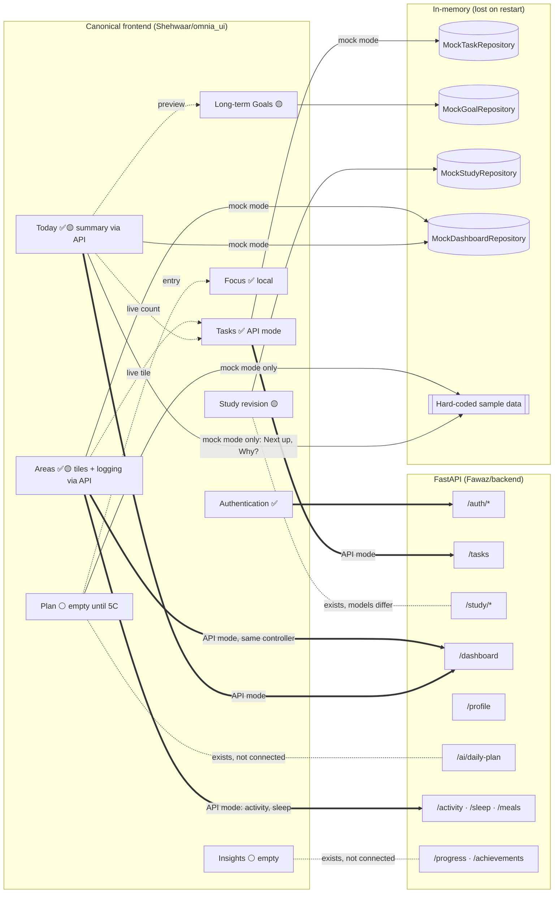

# Current Status

A snapshot verified against the source, not against the README. Back to [[00 - OMNIA|OMNIA]].

> [!summary] In one line
> **In API mode, authentication, Tasks, the profile and daily targets, the Today/Areas day summary (`/dashboard`) and today's activity and sleep logs are real (FastAPI); Goals and Focus are local; nothing else shows data, and no screen shows sample data.** In mock mode, nothing talks to a server and the labelled sample day is shown.
>
> Phase 3 (Tasks) is complete and manually verified. Phase 4 (Dashboard, read-only) is complete: automated verification passed and it was manually verified on the Android emulator against the real backend. Phase 5A (Profile and daily targets editor) is complete: automated verification passed and it was manually verified on the Android emulator against the real backend. Phase 5B (Activity and sleep logging) is complete: automated verification passed, manually verified on the Android emulator, committed as `0375257`. The **UX architecture pass** (tabs Today · Plan · Areas · Insights, per-tab stacks, no sample data in API mode, selection-over-typing, Archivo/Space Mono typography) passed automated verification and is **uncommitted; manual emulator check pending**. See [[Navigation and Information Architecture]].

## Feature integration map

Thick arrow = wired today. Dotted arrows to the backend = the backend endpoint exists, but the canonical frontend doesn't call it.

## Status table

| Area | Status | Data source today | Backend support | Note |
|---|---|---|---|---|
| [[Authentication Flow\|Authentication]] | `api-connected` | FastAPI `/auth/*` | [[Authentication API]] | Manually verified on the Android emulator (per README) |
| [[Tasks]] | `api-connected` (API mode) | `ApiTaskRepository` (API mode) · `MockTaskRepository` (mock mode) | [[Tasks API]] full CRUD | [[Phase 3 - Tasks API Integration]]: complete (automated + manual emulator verification) |
| [[Goals]] (long-term) | `local-functional` | `MockGoalRepository` (API mode: starts empty, labelled "not synced") | ❌ none | Not the same as [[Daily Targets]] |
| [[Focus]] | `local-functional` | `FocusTimerController` (app-wide, not stored) | `/study/sessions` could log time | Intentionally app-wide |
| [[Study]] | `partial` | Study screen: dashboard study minutes and next exam, Focus timer. Sample revision session in mock mode only | [[Study API]] | Frontend and backend models differ |
| [[Dashboard]] (Today) | `partial` | API mode: greeting, name, date, next exam and Study/Activity/Sleep from `/dashboard`. Mock mode: `MockDashboardRepository` (the sample day). Tasks card and Goals preview unchanged. API mode: Next up says "No plan yet.", no "Why?"; mock mode keeps the labelled sample. | [[Profile and Dashboard API]] | [[Phase 4 - Dashboard API Integration]]: complete (automated + manual emulator verification) |
| [[Plan]] | `sample` (mock) · empty (API) | Mock: `samplePlan` constant. API: "No plan yet." + Focus entry | [[AI API]] | Real plan is Phase 5C |
| [[Areas]] (was Track) | `partial` | Study/Tasks/Goals/Activity/Sleep tiles from the session controllers; each opens its area ([[Phase 5B - Activity and Sleep Logging]] for the logs) | `/dashboard`; [[Activity API]], [[Sleep API]] | No meals logging |
| [[Insights]] | empty | "No insights yet" (mock mode labelled `SAMPLE DATA`) | [[Progress API]] | Not connected |
| [[Settings]] | `api-connected` (account section) | Theme local; account and profile via `AuthController` | [[Authentication API]], [[Profile and Dashboard API]] | Account section and "Profile & daily targets" only in API mode |
| [[Daily Targets]] | `api-connected` (API mode) | Edited in Settings → "Profile & daily targets" (`PATCH /profile`); shown as the card and tile targets from `/dashboard` | `/profile`, `/dashboard` | [[Phase 5A - Profile and Daily Targets]]: complete (automated + manual emulator verification) |
| [[Nutrition]] | `planned` | None | [[Nutrition API]] | Donor UI exists |
| Social | `planned` | None | [[Social API]] | Donor UI exists |
| [[AI Assistant]] | `planned` | None | [[AI API]] (daily plan only) | No AI in canonical frontend |
| [[Achievements and Life Timeline]] | `planned` | None | `/achievements` (fixed list) | Life Timeline is vision only |

## Mode matrix

See [[Mock vs API Mode]].

| | Mock mode (`flutter run`) | API mode (`--dart-define=OMNIA_DATA=api`) |
|---|---|---|
| Sign-in | None | Real (FastAPI) |
| Tasks | In-memory, one session for app life | **FastAPI `/tasks`**, scoped to the signed-in user |
| Goals | In-memory sample goals, one session for app life | In-memory, **starts empty** per signed-in user |
| Study | Sample revision session | Dashboard figures only (revision session hidden) |
| Focus | App-wide, local | App-wide, local |
| Today / Areas day summary | Sample (`MockDashboardRepository`, steps and sleep from the shared mock track state) | **FastAPI `/dashboard`**, per user |
| Today's activity and sleep logs | In-memory `MockTrackRepository` (seeded with the sample day) | **FastAPI `/activity/{day}`, `/sleep/{day}`**, per user |
| Plan, Insights | Sample (labelled) | Empty states, never sample |

## What "verified" means here

- Wiring was read from `lib/app.dart`, `lib/core/session.dart` and `lib/core/app_dependencies.dart`: `AppDependencies.mock()` is used in mock mode and `AppDependencies.api(api)` for signed-in sessions in API mode (Tasks and the dashboard).
- Sample content is gated by `AppDependencies.sampleContent` (true only in mock mode); screens were checked for their on-screen labels (`SAMPLE DAY`, `SAMPLE DATA`) and the `samplePlan` constant.
- The emulator check of authentication is recorded in `Shehwaar/README.md`. It was not re-run while building this vault.
