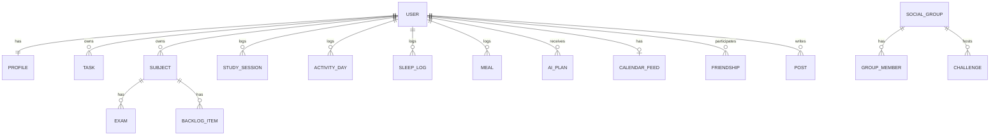

# Data Model Overview

Frontend models live in `Shehwaar/omnia_ui/lib/**/domain` and `lib/core/models`. Backend models are SQLAlchemy classes in `Fawaz/backend/app/modules/*/models.py`. They are **not** generated from each other, and several of them differ in shape.

## Side by side

| Concept | Canonical frontend | Backend | Match? | Note |
|---|---|---|---|---|
| Account | [[User]] (`id`, `email`, `displayName`, `timezone`, `username`) | `User` + `Profile` | ✅ subset | The frontend reads only what auth needs |
| To-do | [[Task]] | `Task` | 🟡 mappable | Mapping known and implemented in donor code |
| Long-term goal | [[Goal]] | — | ❌ none | Needs a new module |
| Daily target | — | `Profile.daily_*` | ❌ not in frontend | [[Daily Targets]] |
| Subject | `Subject` (`id`, `name`, `description`) | `Subject` (`name`, `color`) | 🟡 | description vs color |
| Exam | `Exam` (`scheduledAt` DateTime) | `Exam` (`exam_date`, `notes`) | 🟡 | |
| Study session | [[Study Session]] with embedded `RevisionItem`s | `StudySession` = logged minutes | ❌ different concept | |
| Revision item | `RevisionItem` (embedded) | `BacklogItem(kind=revision)` | 🟡 likely mapping | |
| Category | `OmniaCategory` enum | `Category` literal | ✅ | Same six names: study, tasks, activity, sleep, nutrition, habits |
| Focus preset / phase | `FocusPreset`, `FocusPhase` | — | n/a | Local only |
| Activity, sleep, meals, AI plan, social | — | ✅ | n/a | Backend only |

## Backend entity graph

Every user-owned table cascades on user delete. That's how `POST /auth/delete-account` removes all of a user's data.

## Conventions worth keeping in mind

- **IDs:** the frontend mocks use readable string ids (`task-assignment`). The backend uses server-assigned UUIDs, and the repository contracts already say to "always use returned entities".
- **Dates:** the backend sends `YYYY-MM-DD` in the user's time zone. The canonical `core/api/json.dart` has `parseDay` / `formatDay` to keep them as local calendar dates.
- **JSON casing:** the frontend `toJson` uses camelCase (`dueAt`). The backend uses snake_case. API repositories need explicit mappers, as the donor's `taskFromApi` / `taskToApi` do. The frontend `fromJson`/`toJson` methods **aren't** backend formats.

Related: [[Repository Pattern]] · [[Frontend Backend Integration]] · [[Backend Overview]] · up: [[00 - OMNIA|OMNIA]]
