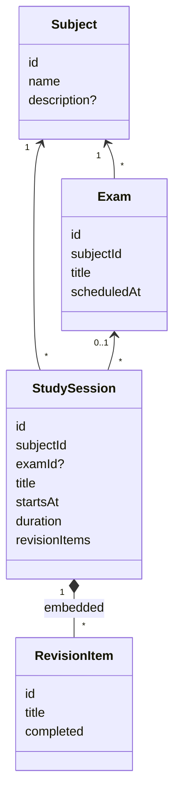

# Study Session

Covers the canonical study domain (`lib/features/study/domain/`): `StudySession`, `RevisionItem`, `Subject` and `Exam`.

## Canonical frontend

- `StudySession` is a **planned** block (`startsAt`, `duration > 0`) that embeds unique-id `RevisionItem`s.
- `RevisionItem`'s comment: *"A sub-task embedded in a study session, not a second standalone task system."*
- `MockStudyRepository` checks that the subject exists and that an exam belongs to the same subject (`invalidReference`).
- Sample: `session-dbms-revision`, "DBMS Revision", 45 min, 3 items.

## Backend (different concept)

| Backend | Meaning |
|---|---|
| `StudySession` | Time **actually studied**: `session_date`, `duration_minutes`, optional subject and backlog item |
| `BacklogItem` | A topic to cover: `kind` = `backlog` or `revision`, `status` = pending or done, `estimated_minutes` |
| `PlanBlock` (not stored) | A suggested block from `/study/plan` or the dashboard's `study_today` |

So the canonical "session with checklist" is closest to **a plan block plus its revision backlog items**, and completing it could log a backend `StudySession`. That's an open design decision for the Study integration phase.

Related: [[Study]] · [[Study API]] · [[Data Model Overview]] · [[Adaptive Learning Roadmap]]
