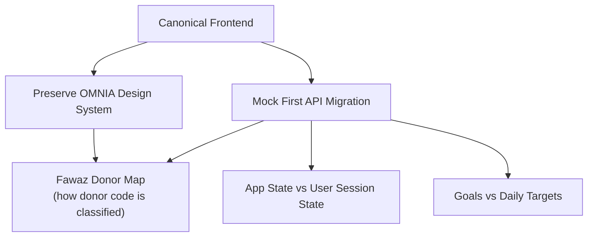

# Architecture Decisions

Lightweight ADR-style records. Each one has **Context → Decision → Reasons → Consequences**.

| Decision | One-line summary | Status |
|---|---|---|
| [[Canonical Frontend]] | `Shehwaar/omnia_ui` is the app. `Fawaz/lib` is a donor. | Accepted |
| [[Goals vs Daily Targets]] | Long-term Goals and daily targets are separate domain concepts | Accepted |
| [[Mock First API Migration]] | Migrate one feature at a time. Keep mock mode forever. | Accepted, in progress |
| [[App State vs User Session State]] | Per-user state lives in `UserSession`, keyed by user id. Focus stays app-wide. | Accepted |
| [[Preserve OMNIA Design System]] | Port functionality, never old screens | Accepted |

Related: [[Architecture Overview]] · [[Fawaz Donor Map]] · [[Roadmap]] · up: [[00 - OMNIA|OMNIA]]
