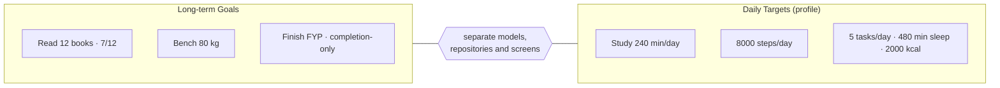

# Goals vs Daily Targets

## Context

The word "goal" means two different things in this repository:

1. **Long-term Goals**: the canonical [[Goals]] feature (`GoalController`, [[Goal]]). Examples: *Read 12 books*, *Bench 80 kg*, *Finish final-year project*. They are measurable (current / target / unit) or completion-only, and completion is an explicit user decision. They're currently in-memory.
2. **[[Daily Targets]]**: backend profile fields (`daily_study_goal_minutes`, `daily_step_goal`, `daily_task_goal`, `daily_sleep_goal_minutes`, `daily_calorie_goal`) that the dashboard compares with today's totals. The backend and the donor app call these "daily goals".

The donor's `ApiGoalRepository` implements a `GoalRepository` by turning the five daily targets into "goals" with fixed ids. Dropping it into the canonical app would compile against a similar interface and **silently replace long-term Goals with daily targets**.

## Decision

**Long-term Goals and daily targets are separate domain concepts**, with separate models, repositories, screens and (eventually) backend storage.

## Reasons

| | Long-term Goal | Daily target |
|---|---|---|
| Time horizon | weeks to years | one day, resets daily |
| Count | any number, user-created | exactly five, fixed |
| Types | measurable **or** completion-only | always numeric |
| Completion | explicit user action, reopenable | implicit (reached today or not) |
| Values | real quantities (22.5 kg, 7 books) | per-day totals (minutes, steps, kcal) |
| Stored | nowhere on the backend yet | `profiles` table |
| Purpose | direction and milestones | consistency and streaks |

Merging them would break the canonical Goal invariants (completion-only goals, explicit completion, values above target) and muddle both UIs.

## Consequences

- The canonical `GoalRepository` stays long-term-only. Its backend needs a **new module** ([[Backend Integration Roadmap]]).
- Daily targets get their own client code and UI: Dashboard and Track progress (read-only, [[Phase 4 - Dashboard API Integration]]), then a Settings editor.
- The donor's `ApiGoalRepository` is **INCOMPATIBLE** for canonical Goals, but it's a useful **REFERENCE** for daily targets ([[Fawaz Donor Map]]).
- In the vault, UI copy and code, "Goals" means long-term goals, and the profile values are called "daily targets".
- They can still interact later. A long-term goal like "Walk 10,000 steps a day" (a seeded mock goal) could relate to the step target, but that's an explicit future link, not a shared model.

Related: [[Architecture Decisions]] · [[Goals]] · [[Daily Targets]] · [[Profile and Dashboard API]]
