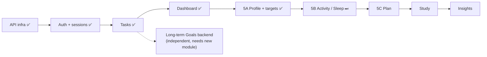

# Mock First API Migration

## Context

The canonical frontend was built on local mock data. The backend and a donor client already existed. The team could either switch the whole app to the backend at once, or migrate one feature at a time.

## Decision

**Migrate backend features incrementally, one feature per phase, behind the existing repository interfaces. Keep mock mode working permanently.**

Order so far: API infrastructure (`10e8ad2`) → authentication and sessions (`70864a7`) → **Tasks** ([[Phase 3 - Tasks API Integration]], complete).

## Reasons

- **Smaller regressions:** each phase touches one feature's repository and wiring.
- **Easier testing:** each phase adds its own fake-backend tests, and the rest of the suite still runs on mocks without a server.
- **Preserves working UI:** screens and controllers don't change. Only the `AppDependencies` implementation does.
- **Isolates backend issues:** a mismatch in tasks can't break Goals or Focus.
- **Mock mode keeps value:** demos, UI work and CI need no backend.
- **Model mismatches get handled one at a time:** Tasks maps cleanly, while Study and Goals need design work first.

## Consequences

- API mode is temporarily a hybrid: real accounts, local features. The README and this vault say so explicitly ([[Mock vs API Mode]]).
- `AppDependencies` gains an API-aware factory, and each phase flips one field.
- Features without backend support (long-term Goals) or with mismatched models (Study) wait for their own design phase.
- Each phase has an explicit verification list, like the one in [[Phase 3 - Tasks API Integration]].

Related: [[Architecture Decisions]] · [[Repository Pattern]] · [[Backend Integration Roadmap]]
