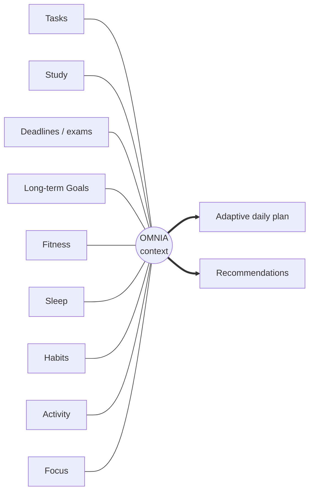

# AI Assistant

> [!caution] Not implemented in the canonical frontend
> The canonical app contains **no AI**. The Home "Sample recommendation" card and the revision screen's "AI explanation" are sample copy, and both say so on screen.

## What exists in the backend today

The [[AI API]] (`modules/ai`) generates **one kind of output: a daily plan**.

- The default provider is `rules`, a deterministic rule-based planner that works offline with no key.
- An optional `anthropic` provider is set on the **server** via `AI_PROVIDER`, `AI_API_KEY` and `AI_MODEL`. If it fails, the rules provider answers and `is_fallback = true`.
- Context is deliberately minimal and anonymised: the [[Daily Targets]], today's and yesterday's totals, streaks, upcoming exams, study blocks, open task titles (as refs like `t1`), last night's sleep and an optional note. Email, name, ids, task notes and deep history are never sent.
- Separately, `POST /nutrition/estimate` estimates a meal from a photo with the same provider (see [[Nutrition]]).

So "AI" in the backend means **plan generation plus one estimator**. There is no conversational assistant, no memory and no cross-module learning.

## The product vision

OMNIA's intended differentiator is **cross-domain intelligence**: not tracking modules in isolation, but understanding how they interact.

Example rules of the vision (**none implemented in the canonical app**):

| Signal | → | Adaptation |
|---|---|---|
| Exam approaching | → | Study gains priority, and the daily plan shifts toward revision |
| Poor sleep | → | Recovery context changes, and workload or training may lighten |
| Missed tasks | → | Plan recalculates priorities |
| Stalled exercise progression | → | Fitness recommendation changes |

The backend's rule-based planner already does simple versions of the first two (exam proximity and short or poor sleep). The canonical frontend doesn't call it yet.

## Related

[[AI Roadmap]] · [[Plan]] · [[Dashboard]] · [[Study]] · [[Fitness and Activity]] · [[Sleep and Recovery]] · [[Achievements and Life Timeline]]
