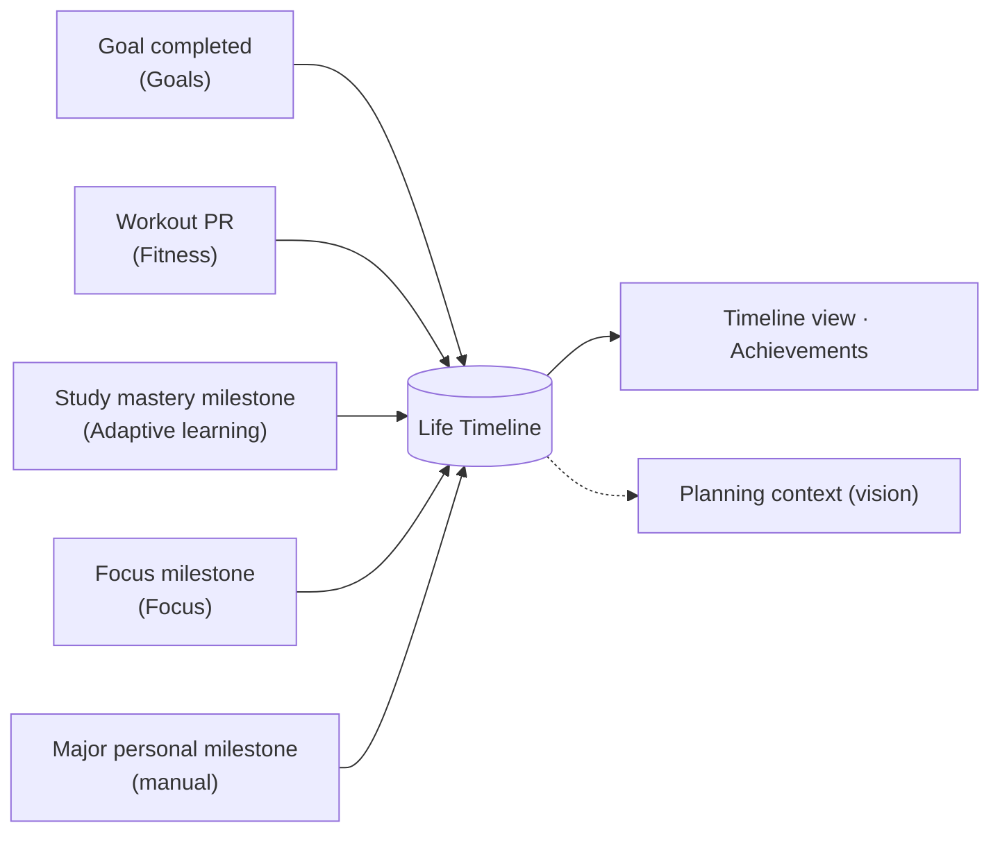

# Achievements and Life Timeline

> [!note] Future concept
> A **Life Timeline** doesn't exist anywhere in the code. This note describes the idea and the small piece of related backend work that does exist.

## What exists

The backend has a **fixed list of 12 achievements** (`modules/progress/achievements.py`), computed from logged data and exposed at `GET /achievements` ([[Progress API]]). For example:

- "First step" (first study session), "Week of focus" (7-day study streak), "Unstoppable" (30 days)
- "Getting things done" (25 tasks), "Task master" (100)
- "Ten workouts", "On the move" (step goal on 10 days), "Well rested" (sleep goal on 7 nights)

These are **count and streak badges**. They don't involve long-term Goals, PRs or personal milestones, and the canonical frontend doesn't show them.

## The concept

Meaningful events from every module become entries on a personal timeline:

Prerequisites: these events have to exist and be **persisted** first. That means long-term [[Goals]] on the backend, workout progression ([[Fitness Roadmap]]), mastery tracking ([[Adaptive Learning Roadmap]]) and stored focus sessions ([[Focus]]).

## Related

[[Insights]] · [[AI Assistant]] · [[Roadmap]]
