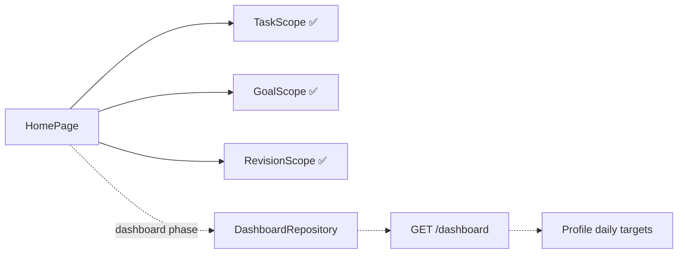

# Dashboard

The **Home** tab of the canonical app.

## Purpose

A single view of the day: greeting, a highlighted recommendation, category cards, the long-term Goals preview and a **Next up** agenda.

## Current Status

`partial`. Mostly sample content, labelled `SAMPLE DAY`, with three live pieces:

| Piece | Source | Live? |
|---|---|---|
| Tasks card (`done / total`) | `TaskScope` | ✅ live (in-memory) |
| Goals preview (2 most pressing active) | `GoalScope` | ✅ live (in-memory) |
| Revision agenda item title | `RevisionScope` | ✅ live (in-memory) |
| Greeting "Good morning, Shew." | hard-coded string | ❌ ignores the signed-in user's name |
| Date "Tuesday, September 23" | hard-coded | ❌ |
| Sample recommendation card | hard-coded | ❌ labelled "Sample recommendation" |
| Other category cards and agenda | `samplePlan` / constants | ❌ |

## Current Frontend

`features/home/home_page.dart`, `widgets/category_card.dart`, `widgets/agenda_line.dart`, `widgets/goals_preview.dart`. Navigation: Settings button, Tasks card → [[Tasks]], Goals preview → [[Goals]], agenda → [[Study]] revision or sample dialogs, and the `openPlan`/`openTrack` tab callbacks.

## State / Controller

No dedicated controller. It reads the session scopes.

## Backend

`GET /api/dashboard` returns "everything the Today screen needs in one call": `greeting`, `display_name`, a `today` summary (study minutes, tasks completed, steps, workout, sleep and calories, each **against its [[Daily Targets|daily target]]**), `streaks`, `next_exam`, `upcoming_tasks`, `study_today` plan blocks and the stored `ai_plan`. See [[Profile and Dashboard API]].

The donor has `DashboardRepository` + `Dashboard.fromJson` to adapt ([[Fawaz Donor Map]]).

## Data Flow (target)

## Related Features

[[Tasks]] · [[Goals]] · [[Plan]] · [[Track]] · [[Daily Targets]] · [[AI Assistant]]

## Future Direction

Fill the category cards from `/dashboard`, use `display_name` in the greeting, and add a daily-targets editor in [[Settings]]. **Long-term Goals preview stays as it is.** See [[Backend Integration Roadmap]] and [[Goals vs Daily Targets]].
