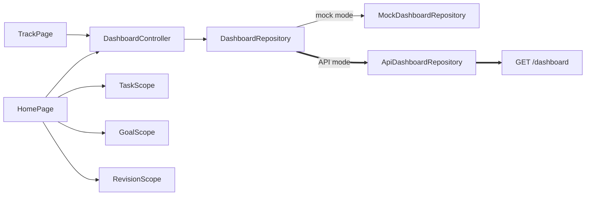

# Dashboard

The **Home** tab of the canonical app.

## Purpose

A single view of the day: greeting, a highlighted exam countdown, category cards, the long-term Goals preview and a **Next up** agenda.

## Current Status

`partial`. Since [[Phase 4 - Dashboard API Integration]] (complete; manually verified on the Android emulator against the real backend with real name, date, no-exam and exam states and unlogged figures), the day summary comes from `DashboardController`: `GET /dashboard` in API mode, `MockDashboardRepository` (the sample day) in mock mode.

| Piece | Mock mode | API mode |
|---|---|---|
| Greeting "Good {morning}, {name}." | sample (Shew) | ✅ server `greeting` + `display_name` (profile time zone) |
| Date line | "Tuesday, September 23 · SAMPLE DAY" | ✅ server `date`, no sample label |
| Exam card headline and detail | sample DBMS exam + sample plan sentence, `SAMPLE` tag | ✅ `next_exam` ("today" / "tomorrow" / "in N days", title and date), or "No exams coming up." |
| Study / Activity / Sleep cards | sample figures | ✅ `today` vs the profile's [[Daily Targets]]; sleep shows **Not logged** when null |
| Tasks card (`done / total`) | `TaskScope` | `TaskScope` (unchanged; not the dashboard's `tasks_completed`) |
| Goals preview | `GoalScope` | `GoalScope` (unchanged) |
| Next up agenda | sample | sample, with a `SAMPLE` tag |
| "Why?" dialog, "View today's plan" | sample | sample (the dialog is titled "Sample recommendation") |

Loading shows "Hello." and dashes; a first-load failure shows "Couldn't load today." with **Try again**. Pull down to refresh; a failed refresh keeps the last day and shows a snackbar. The dashboard also reloads when the app returns to the foreground.

## Current Frontend

`features/home/home_page.dart`, `dashboard_controller.dart`, `dashboard_format.dart`, `domain/dashboard.dart`, `domain/dashboard_repository.dart`, `data/api_dashboard_repository.dart`, `data/mock_dashboard_repository.dart`; widgets `category_card.dart`, `agenda_line.dart`, `goals_preview.dart`.

## State / Controller

`DashboardController` (per [[Session Architecture|UserSession]], shared with [[Track]]), plus `TaskScope`, `GoalScope` and `RevisionScope`.

## Backend

`GET /api/dashboard`. See [[Profile and Dashboard API]] for the fields read and those left for later phases.

## Data Flow

## Related Features

[[Tasks]] · [[Goals]] · [[Plan]] · [[Track]] · [[Daily Targets]] · [[AI Assistant]]

## Future Direction

The targets it shows are edited in [[Settings]] since [[Phase 5A - Profile and Daily Targets]]; a save reloads the dashboard. Next: "Next up" and "Why?" from the daily plan, and possibly the Tasks card from the dashboard's `tasks_completed` (a semantics decision). **Long-term Goals preview stays as it is.** See [[Backend Integration Roadmap]] and [[Goals vs Daily Targets]].
