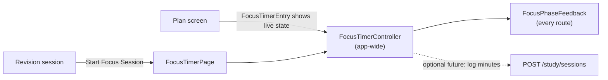

# Focus

## Purpose

A Pomodoro-style focus timer: focus and break phases alternate, and completed focus sessions are counted.

## Current Status

`local-functional`. Fully working and deliberately **app-wide**. Nothing is persisted: the session count resets when the app restarts.

## Current Frontend

- `features/focus/focus_timer_page.dart`: the timer screen, with preset picker and custom validation
- `features/focus/widgets/focus_timer_entry.dart`: compact live entry on the [[Plan]] screen
- `features/focus/widgets/focus_phase_feedback.dart`: wraps every route (`MaterialApp.builder`). When a phase ends it fires a heavy haptic and a screen-reader announcement, **once**.
- Entry points: Plan (`FocusTimerEntry`) and the revision session's **Start Focus Session** button ([[Study]]).

## State / Controller

`FocusTimerController` (in `FocusTimerScope`), created **once** in `_OmniaAppState`, next to the theme:

- Presets: *Standard* 25/5 and *Deep focus* 50/10, plus custom (focus 1–180 min, break 1–60 min, validated by `FocusPreset.validateMinutes`).
- Controls: start, pause, resume, reset, skip. The UI confirms a preset change mid-session.
- **Deadline-based:** remaining time is `deadline − now`, re-read on a 200 ms ticker, so a delayed tick or a route change can't make it drift.
- A natural finish sets `justFinished`, moves to the next phase and waits for the user. A skipped focus phase isn't counted.
- The class comment says "Future Focus Mode should drive this same controller rather than adding a second countdown."

## Why app-wide

The timer has to keep running while the user navigates, and the phase feedback has to work on any screen. It belongs to the device session, not to a user's data. See [[App State vs User Session State]]. Consequence: a running timer survives sign-out. That's accepted at this stage.

## Relationship with Plan

Plan hosts the entry point and today's sample "focus activity". Focus does not know which plan item it's for.

## Backend

There's no focus module. The closest backend concept is `POST /study/sessions` (log minutes studied, optionally against a subject or backlog item). See [[Study API]]. The donor's `focus_session_page.dart` does exactly that with a simple stopwatch. **It shouldn't replace this timer** ([[Fawaz Donor Map]]).

## Related Features

[[Plan]] · [[Study]] · [[Insights]] (future focus stats) · [[Achievements and Life Timeline]] (focus milestones)

## Future Direction

- Optionally log completed focus minutes as study sessions once [[Study]] is integrated.
- Focus milestones as achievements (vision).
- Don't rebuild it because the donor has a different implementation.
