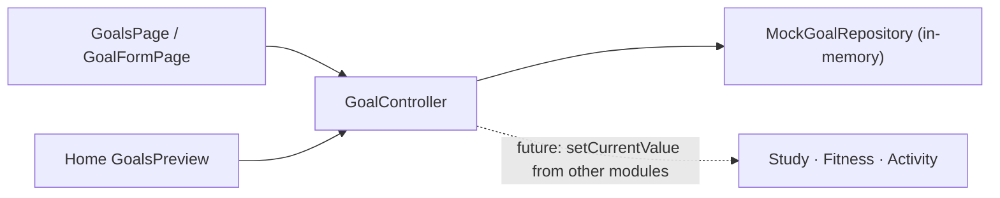

# Goals

> [!warning] Long-term Goals only
> This note covers **long-term Goals** (for example *Read 12 books*, *Bench 80 kg*, *Finish final-year project*). They are **not** the backend's [[Daily Targets]] (study minutes, steps, tasks, sleep, kcal). See [[Goals vs Daily Targets]].

## Purpose

Track long-term objectives of two kinds:

- **Measurable:** `current / target unit`, e.g. `22.5 / 30 kg`. The percentage is always **derived** (floor of current÷target, capped at 100 for display), never typed in.
- **Completion-only:** no numbers, just active or completed.

Completion is always the **user's decision**. Reaching the target doesn't complete a goal, and completing it doesn't change its values, so reopening restores the real progress.

## Current Status

`local-functional`. Create, edit, delete (confirmed), complete and reopen, plus Active and Completed sections and a Home preview of the two most pressing active goals. Data is **in-memory** (`MockGoalRepository`) and resets on restart or sign-in.

## Current Frontend

- `features/goals/goals_page.dart`: Active (nearest target date first) and Completed sections
- `features/goals/goal_form_page.dart`: type switch, validation, decimals
- `features/home/widgets/goals_preview.dart`: Home preview, opens `GoalsPage`

## State / Controller

`GoalController` via `GoalScope`, per [[Session Architecture|UserSession]]. It has the same shape as `TaskController` (bool-returning mutations, busy guard). It also has `setCurrentValue(id, value)`, which rejects completion-only goals. A code comment names it as the future entry point for "other modules (study, workouts, activity)" to report real quantities. Nothing calls it that way yet.

## Repository

`GoalRepository` → `MockGoalRepository` (six seeded goals, one completed). Model: [[Goal]]. See [[Repository Pattern]].

## Backend

**None.** `Fawaz/backend` has no long-term goals module or table. The donor's `ApiGoalRepository` targets `/dashboard` and `/profile` daily targets and is **incompatible**. See [[Fawaz Donor Map]].

## Data Flow

## Related Features

[[Dashboard]] (preview) · [[Fitness and Activity]] (e.g. strength goals) · [[Study]] (e.g. chapters) · [[Achievements and Life Timeline]] (completed goals as milestones)

## Future Direction

- A new backend module designed for measurable and completion-only goals: see [[Backend Integration Roadmap]].
- Automatic progress reporting from other modules via `setCurrentValue`: see [[Fitness Roadmap]] and [[Adaptive Learning Roadmap]].
- Completed goals as timeline events: see [[Achievements and Life Timeline]].

Checkpoint: commit `d1e908a` ([[Git Checkpoints]]).
