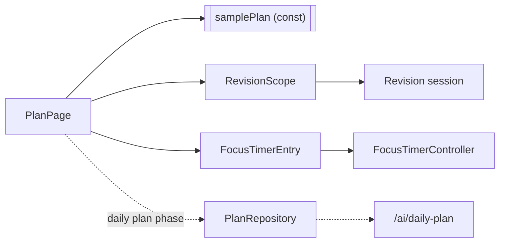

# Plan

## Purpose

The day's schedule, eventually an adaptive daily plan that reacts to sleep, exams, tasks and more.

## Current Status

`sample`. Timeline and list views of a **fixed sample day** (`samplePlan` in `features/plan/plan_item.dart`, labelled `SAMPLE DAY`). Two parts are live:

- The **revision** item opens the real [[Study]] revision session and shows its current title.
- The **Focus** entry (`FocusTimerEntry`) shows the live app-wide [[Focus]] timer.

Other items open an info dialog: "This is a sample plan item. Editing and scheduling other activities are coming soon." Rescheduling is explicitly marked as not implemented.

## Current Frontend

`features/plan/plan_page.dart`, `plan_item.dart`, `widgets/timeline_row.dart`.

## State / Controller

None for plan data (it's a `const` list). The revision title comes from `RevisionScope`, the timer from `FocusTimerScope`.

## Backend

[[AI API]]: `POST /ai/daily-plan` (get or generate, with `regenerate` and an optional note like "slept badly") and `GET /ai/daily-plan?date=`. The plan is built by a **rule-based provider by default**. An Anthropic provider is optional and configured server-side, and it falls back to rules on failure. The [[Study API]] also offers `GET /study/plan` (a multi-day study allocation).

The donor has `PlanRepository`, `DailyPlan` and `PlanController` to adapt. Its Plan UI is reference only ([[Fawaz Donor Map]]).

## Data Flow

## Related Features

[[Focus]] · [[Study]] · [[Tasks]] · [[Dashboard]] · [[AI Assistant]] · [[Sleep and Recovery]]

## Future Direction

Replace the sample day with the backend daily plan, including regeneration and the "what changed" adjustments, while keeping the canonical timeline and list views. Later, cross-domain replanning (vision): see [[AI Roadmap]].
