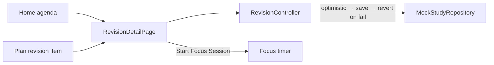

# Study

## Purpose

Today: one **revision session** with a checklist of sub-tasks. Long term: an **Adaptive Learning & Revision** system (see [[Adaptive Learning Roadmap]]).

## Current Status

`partial`. The revision session is interactive (check items, mark all, rename, reset) and saves to an in-memory repository. The subject, exam, notes and "AI explanation" text are **sample** content, and the screen labels them so.

## Current Frontend

- `features/plan/revision_detail_page.dart`: the session screen, opened from Home's agenda and Plan's revision items
- `features/plan/revision_actions.dart`: rename dialog, **More** menu
- `features/study/domain/*`: `Subject`, `Exam`, `StudySession`, `RevisionItem`
- Sample content: *DBMS Revision*, 3 items, DBMS exam, "DBMS Notes.pdf · Sample"

There is no standalone Study screen in the canonical app.

## State / Controller

`RevisionController` (in `RevisionScope`), per [[Session Architecture|UserSession]]. It holds **one** `StudySession`. Edits are optimistic: apply locally → `updateSession` → keep the saved result if it's still current → **revert on failure** (and rethrow).

## Repository

`StudyRepository` → `MockStudyRepository`. The interface is read-mostly: `getSubjects`, `getExams`, `getSessions`, `getSession`, `updateSession`. The mock validates subject and exam references. Model: [[Study Session]].

## Backend

The [[Study API]] is extensive: subjects, exams (with `days_left`), a backlog of topics (`kind`: `backlog` | `revision`), logged sessions, and a rule-based `GET /study/plan` for 1–28 days.

**The models don't line up:**

| Canonical frontend | Backend |
|---|---|
| `StudySession` = planned block **with embedded `RevisionItem`s** | `StudySession` = a **logged** amount of time (`duration_minutes`, `session_date`) |
| `RevisionItem` (id, title, completed) inside a session | `BacklogItem` (subject, title, kind, status, estimated_minutes) |
| `Exam.scheduledAt` (DateTime) | `Exam.exam_date` (date) + `notes` |

The donor's `ApiStudyRepository` uses a **different, larger interface** (topics, log session, plan). An integration phase has to decide how the canonical revision session maps onto backlog items and plan blocks before any repository swap. See [[Frontend Backend Integration]].

## Data Flow

## Related Features

[[Plan]] · [[Focus]] · [[Dashboard]] · [[Goals]] (e.g. "Finish DBMS chapters" is a *goal*, not a study entity)

## Future Direction

The adaptive learning loop (Learn → Practice → Measure mastery → Identify weak topics → Prioritize revision → Retest), plus flashcards, quizzes, MCQs, timed tests, mastery and performance history. **None of this is implemented.** See [[Adaptive Learning Roadmap]].
