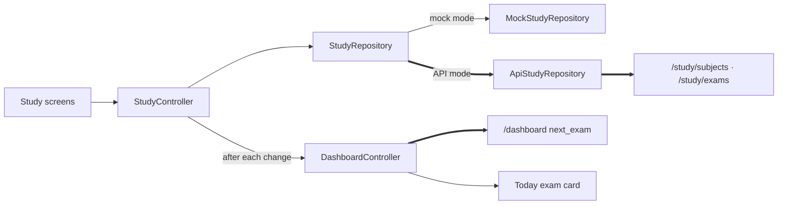

# Study

## Purpose

Today: the user's **subjects and exams**, kept on the backend, plus today's study time and the Focus timer. Long term: an **Adaptive Learning & Revision** system (see [[Adaptive Learning Roadmap]]).

## Current Status

`partial`. **Study V1** (uncommitted working tree on `eda9150`): subjects and exams are real in API mode.

| | API mode | Mock mode |
|---|---|---|
| Subjects: list, add, rename, delete (deletes its exams) | ✅ `/study/subjects` | in-memory, sample *DBMS* |
| Exams: upcoming list (nearest first), add, edit, delete | ✅ `/study/exams` | in-memory, sample *DBMS exam* |
| Today's next exam | ✅ `/dashboard` `next_exam` (the first upcoming exam), reloaded after every study change | derived from the same mock study data |
| Today's study minutes / target | ✅ `/dashboard` | sample |
| Revision session (checklist) | hidden | sample, labelled |
| Backlog, logged sessions, study plan | not shown | not shown |

The Study screen is labelled `SAMPLE` in mock mode. API mode never shows sample subjects or exams: with none, it says "No exams yet." / "No subjects yet." with an add button.

> [!note] Where "DBMS exam in 3 days" came from
> In API mode, a DBMS exam on Today is a **real row** in the backend database (added by hand during earlier testing). Nothing seeds it. The frontend's own DBMS sample ("in 8 days") exists only in mock mode.

## Current Frontend

- `features/study/study_page.dart`: the Study hub (Today's study, upcoming exams, subjects, Focus, mock-only revision)
- `subject_detail_page.dart`, `exam_detail_page.dart`: live from the controller; rename/edit, delete with confirmation
- `subject_form_page.dart`, `exam_form_page.dart`: full-screen forms. An exam's subject is **picked** from the user's subjects (never retyped); with none, the form offers "New subject" first. The date is a date picker from the server's today. There is no time or exam type: the backend has neither.
- `widgets/exam_card.dart`: exam card with a `TODAY` / `TOMORROW` / `IN N DAYS` tag (from the server's `days_left`)
- `features/plan/revision_detail_page.dart`, `revision_actions.dart`: the mock-mode revision session

## State / Controller

- `StudyController` (in `StudyScope`), per [[Session Architecture|UserSession]]: the one copy of the subject and upcoming-exam lists. Loaded when Study opens. After each change it reads both lists back from the repository and reloads `DashboardController`, so Today's exam follows. A refusal throws `ApiException`, so forms keep their input and show the message under the right field (e.g. a duplicate subject name, `409`).
- `RevisionController` (in `RevisionScope`): the demo session, unchanged.

## Repository

- `StudyRepository` (subjects + exams) → `ApiStudyRepository` (API mode) / `MockStudyRepository` (mock mode). See [[Repository Pattern]].
- `RevisionRepository` (the demo session) → `MockStudyRepository` in both modes; the backend has no equivalent.

## Backend

[[Study API]]: full CRUD for subjects and exams; also a backlog of topics (`kind`: `backlog` | `revision`), logged sessions (the source of today's study minutes), and a rule-based `GET /study/plan`. Every row is scoped to the token's user; another user's id answers `404`. Deleting a subject cascades to its exams and backlog; logged sessions are kept, unlinked. The exact contract the frontend uses is in `Shehwaar/omnia_ui/integration/API_CONTRACT.md`.

What still doesn't line up (and so isn't wired):

| Canonical frontend | Backend |
|---|---|
| Demo `StudySession` = planned block **with embedded `RevisionItem`s** | `StudySession` = a **logged** amount of time |
| `RevisionItem` inside a session | `BacklogItem` (subject, title, kind, status, estimated_minutes) |

## Data Flow

## Related Features

[[Plan]] · [[Focus]] · [[Dashboard]] · [[Goals]] (e.g. "Finish DBMS chapters" is a *goal*, not a study entity)

## Future Direction

Backlog/revision items and logged sessions (the backend supports them), then the adaptive learning loop (Learn → Practice → Measure mastery → Identify weak topics → Prioritize revision → Retest), flashcards, quizzes, mastery and performance history. **None of that is implemented.** See [[Adaptive Learning Roadmap]].
