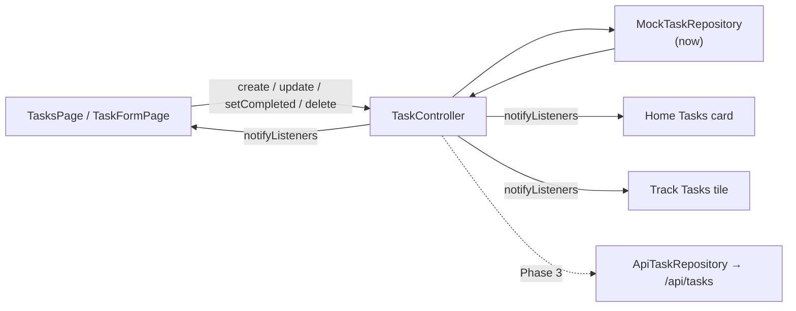

# Tasks

## Purpose

Everyday to-dos: title, optional description, priority, category, optional due date with an optional time, and an optional estimated duration.

## Current Status

`local-functional`. Create, edit, complete/uncomplete and delete (with confirmation) all work, but on an **in-memory** repository in **both** modes. Nothing survives a restart. In API mode each signed-in user starts from the seeded mock data again.

## Current Frontend

- `features/tasks/tasks_page.dart`: list, loading, empty, and error-with-retry states
- `features/tasks/task_form_page.dart`: create/edit form
- `features/tasks/task_format.dart`: display helpers (`isAllDay` = local 00:00)
- Consumers of the same controller: Home **Tasks** card (`done / total`, opens `TasksPage`) and the Track **Tasks** tile. See [[Dashboard]] and [[Track]].

## State / Controller

`TaskController` (`ChangeNotifier`, exposed through `TaskScope`), created per [[Session Architecture|UserSession]] with `..load()`:

- Ordering: open first → due date (undated last) → newest `createdAt`.
- Mutations return `Future<bool>`. On failure the state is left as the repository had it.
- A per-task `_busy` set ignores a second operation while one is in flight (double-tap guard).
- `create` stores the **returned** entity, so a server-assigned id will just work.

## Repository

`TaskRepository` → `MockTaskRepository` (`InMemoryDataSource<Task>`, seeded with one sample task, "Complete Assignment"). See [[Repository Pattern]] and the model in [[Task]].

## Backend

The [[Tasks API]] provides full CRUD at `/api/tasks`, scoped per user. The Fawaz donor has a matching `ApiTaskRepository` that implements the **same interface**. See [[Fawaz Donor Map]].

## Data Flow

## Related Features

[[Dashboard]] · [[Track]] · [[Plan]] (sample "Complete Assignment" item, not linked to the real task) · [[Goals]]

## Future Direction

[[Phase 3 - Tasks API Integration]] is the next milestone. After it, tasks are expected to feed the dashboard's `tasks_completed` and the AI daily plan. See [[Backend Integration Roadmap]] and [[AI Roadmap]].
