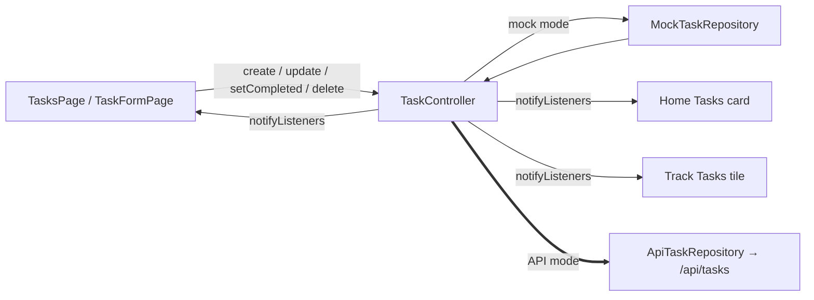

# Tasks

## Purpose

Everyday to-dos: title, optional description, priority, category, optional due date with an optional time, and an optional estimated duration.

## Current Status

`api-connected` in API mode, `local-functional` in mock mode. Create, edit, complete/uncomplete and delete (with confirmation) all work in both modes.

- **API mode:** tasks are stored by FastAPI through `ApiTaskRepository`, scoped to the signed-in user, and survive restarts and sign-out/sign-in.
- **Mock mode:** unchanged. In-memory `MockTaskRepository`; nothing survives a restart.

Phase 3 passed automated verification (fake-backend tests plus a live check against a throwaway FastAPI instance) and was manually verified on the Android emulator against the real backend: create, edit, complete/reopen, delete, persistence across restart and sign-out/sign-in, User A / User B isolation, backend-unavailable behaviour and mock mode.

## Current Frontend

- `features/tasks/tasks_page.dart`: list, loading, empty, and error-with-retry states
- `features/tasks/task_form_page.dart`: create/edit form
- `features/tasks/task_format.dart`: display helpers (`isAllDay` = local 00:00)
- Consumers of the same controller: Home **Tasks** card (`done / total`, opens `TasksPage`) and the Track **Tasks** tile. See [[Dashboard]] and [[Track]].

## State / Controller

`TaskController` (`ChangeNotifier`, exposed through `TaskScope`), created per [[Session Architecture|UserSession]] with `..load()`:

- Ordering: open first → due date (undated last) → newest `createdAt`.
- Mutations return `Future<bool>`. On failure the state is left as the repository had it.
- A per-task `_busy` set ignores a second operation while one is in flight (double-tap guard).
- `create` stores the **returned** entity, so a server-assigned id will just work.

## Repository

`TaskRepository` → chosen per session by `AppDependencies`:

- mock mode: `MockTaskRepository` (`InMemoryDataSource<Task>`, seeded with one sample task, "Complete Assignment")
- API mode: `ApiTaskRepository` (`features/tasks/data/api_task_repository.dart`), adapted from the donor

See [[Repository Pattern]] and the model in [[Task]].

## Backend

The [[Tasks API]] provides full CRUD at `/api/tasks`, scoped per user by the token. The canonical `ApiTaskRepository` implements the unchanged `TaskRepository` interface; it was adapted from the donor with only its imports changed. See [[Fawaz Donor Map]].

## Data Flow

## Related Features

[[Dashboard]] · [[Track]] · [[Plan]] (sample "Complete Assignment" item, not linked to the real task) · [[Goals]]

## Future Direction

[[Phase 3 - Tasks API Integration]] is complete. Next, tasks are expected to feed the dashboard's `tasks_completed` and the AI daily plan. See [[Backend Integration Roadmap]] and [[AI Roadmap]].
