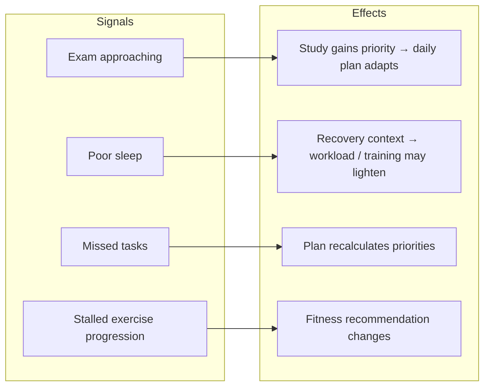

# AI Roadmap

> [!caution] Product vision
> Nothing in this note is implemented in the canonical frontend. The backend's only AI-shaped features are the daily-plan generator (rules by default, with an optional LLM provider) and a food-photo estimator. See [[AI API]].

## The differentiator

OMNIA shouldn't just track independent modules. It should understand **relationships** between Tasks, Study, Deadlines, Goals, Fitness, Sleep, Habits, Activity and Focus, and adapt planning and recommendations to them.

## Stages

| Stage | What it means | Depends on |
|---|---|---|
| 0. Data foundation | Real, persisted data per module | [[Backend Integration Roadmap]] phases 3–8 |
| 1. Daily plan in app | Use the existing `/ai/daily-plan` (rules or LLM) in [[Plan]] | Tasks, dashboard, study integrated |
| 2. Explanations | Surface `adjustments` ("what changed") and `tips` | Stage 1 |
| 3. [[AI Assistant]] | Conversational help with planning, study, fitness and schedule changes | Stage 1 plus a new backend capability |
| 4. Cross-domain recommendations | Learn interactions between sleep, study, tasks, deadlines, fitness, goals and habits | Enough history. [[Fitness Roadmap]] and [[Adaptive Learning Roadmap]] data. |
| 5. Long-term context | Goals, milestones and the timeline inform planning | [[Achievements and Life Timeline]], long-term [[Goals]] backend |

## Constraints already set by the backend

- Provider keys stay **server-side**. The app holds no secrets.
- The context is minimal and anonymised (no email, name, ids or task notes). Any future assistant should keep that stance.
- There's a rule-based fallback when the provider fails (`is_fallback`).

Related: [[Roadmap]] · [[AI Assistant]] · [[Sleep and Recovery]] · [[Study]] · [[Tasks]]
