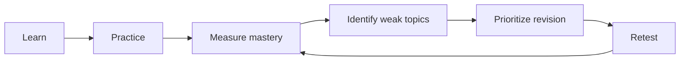

# Adaptive Learning Roadmap

The long-term direction for [[Study]]: **Adaptive Learning & Revision**.

> [!caution] Not implemented
> Neither the canonical frontend nor the backend has flashcards, quizzes, MCQs, timed tests, mastery scores or test results. Today there's one revision checklist in the frontend, plus subjects, exams, backlog topics, logged minutes and a rule-based study plan in the backend.

## The loop

## Planned capabilities

| Capability | Builds on (existing) | New |
|---|---|---|
| Topics per subject | backend `Subject`, `BacklogItem(kind=revision)` | per-topic mastery score |
| Flashcards | none | cards, spaced review |
| Quizzes / MCQs / timed tests | none | question bank, attempts, scoring |
| Topic mastery | none | mastery model from attempts |
| Weak-topic detection | none | thresholds and trends over results |
| Revision prioritization | `GET /study/plan` (exam proximity) | weighting by weakness |
| Retesting | none | scheduled retests |
| Performance history | `study_sessions` (minutes only) | results history |

## Dependencies

1. Study integration first, with the model alignment described in [[Study Session]].
2. Exams and time logging on the backend (these exist).
3. Mastery milestones could feed [[Achievements and Life Timeline]], and weak topics could feed the cross-domain planner ([[AI Roadmap]]).
4. [[Focus]] sessions could attach to practice or revision blocks.

Related: [[Roadmap]] · [[Study API]] · [[Plan]]
