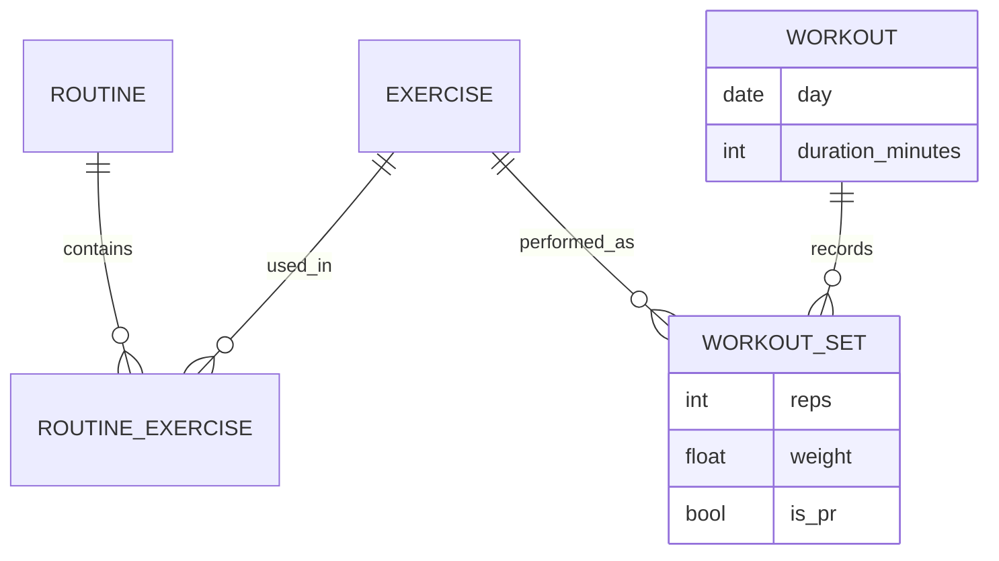

# Fitness Roadmap

The planned workout system. Current state: [[Fitness and Activity]] (sample UI) and [[Activity API]] (a daily summary: steps, workout done, minutes, type).

## Current vs future

| | Current | Future design |
|---|---|---|
| Unit of data | one `ActivityDay` per date | workouts → exercises → sets |
| Detail | `workout_type` text, minutes | routines, exercises, sets, reps, weight |
| History | per-day flags | full workout history, previous-workout comparison |
| Progress | streaks, workout count | exercise progression, PRs, strength and progress charts, frequency and consistency |
| Goals | a manual long-term [[Goals]] entry (e.g. 22.5 / 30 kg) | automatic progress via `GoalController.setCurrentValue` (hook exists, unused) |
| Steps | backend field | kept, from `/activity` |

## Future model (sketch, not implemented)

This is a design sketch for discussion. None of these entities exist.

## Future AI use (vision)

Progression, training volume, consistency, sleep and recovery could drive recommendations such as deload, progression and rest days. See [[AI Roadmap]] and [[Sleep and Recovery]].

## Milestones feeding elsewhere

PRs → [[Achievements and Life Timeline]] · strength goals → [[Goals]] · consistency → [[Insights]].

Related: [[Roadmap]]
