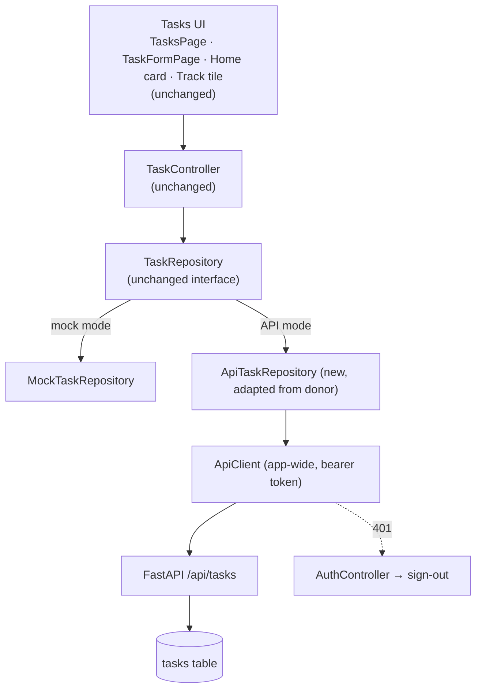

# Phase 3 - Tasks API Integration

> [!note] Status
> **Complete.** Automated verification passed, and the checklist below was manually verified on the Android emulator against the real backend. Committed as the Phase 3 checkpoint after `39487cd`. The target architecture below is what was built.

## Goal

In **API mode**, connect the canonical [[Tasks]] feature to FastAPI, **preserving the current UI and mock mode**.

## Target architecture

## Changes made

1. **`ApiTaskRepository`.** Adapt `Fawaz/lib/features/tasks/data/api_task_repository.dart`:
   - Import `asMap`/`asMapList`/`parseDay`/`formatDay` from `core/api/json.dart` (the donor imports them from `core/models/user.dart`). `isAllDay` already exists in the canonical `task_format.dart`.
   - Keep its mapping: `normal↔medium`, `description↔notes`, `completed↔status`, `dueAt↔due_date+due_time`, minutes, and paging with `limit=200` until `total`.
2. **Wiring.** In API mode, give each `UserSession` an `AppDependencies` whose `tasks` is `ApiTaskRepository(api)`, while goals and study stay mocks. That's likely an extra factory next to `AppDependencies.mock()`, chosen in `app.dart` where `_session(...)` is built for a signed-in user.
3. **Tests.** Add fake-backend routes for `/tasks` (list, create, get, patch, delete). The donor's `test/support/fake_backend.dart` has list and create, not patch or delete. Add repository mapping tests too.

## Things to watch

- **Server ids:** `TaskController.create` already stores the returned entity, so it keeps working. The form still generates a client id, which the server ignores.
- **Time-zone boundary:** a due time of exactly 00:00 local is sent as all-day (a lossy edge that also exists in the donor).
- **Duration precision:** an estimate is sent in whole minutes, so sub-minute values are dropped.
- **Latency:** mock calls are instant and API calls aren't. The existing loading, error-with-retry and busy-guard states will now actually show.
- **Expiry:** task calls will be the first *routine* authenticated calls, so session expiry will surface during normal use ([[Authentication Flow]]).

## Verification checklist

- [x] Create persists (visible after reload from server) — automated + manual
- [x] Edit persists (title, description, priority, category, due date/time, estimate) — automated + manual
- [x] Complete / uncomplete persists — automated + manual
- [x] Delete persists — automated + manual
- [x] App restart preserves server data (API mode) — automated (fresh client, same token) + manual
- [x] Sign out → sign in restores the same user's tasks — manual
- [x] Different users don't see each other's tasks — automated (fake backend, backend pytest, live check) + manual (User A / User B)
- [x] Session expiry (401 on a task call) returns to sign-in once, with the session-ended notice — automated
- [x] Network failure shows the existing error / retry state, and mutations return `false` without corrupting the list — automated + manual (backend stopped)
- [x] Mock mode unchanged (`flutter run` still uses `MockTaskRepository`) — automated + manual
- [x] Tasks UI code unchanged (no UI files modified). Home card and Track tile still live. Exercised manually through the unchanged Tasks UI.
- [x] Existing tests stay green, `flutter analyze` is clean, and new tests are added for the API repository and wiring (128 passing)

## Out of scope

Goals, Study, Dashboard, Plan and any UI redesign.

Related: [[Tasks API]] · [[Task]] · [[Fawaz Donor Map]] · [[Backend Integration Roadmap]] · [[Mock First API Migration]] · [[Testing]]
