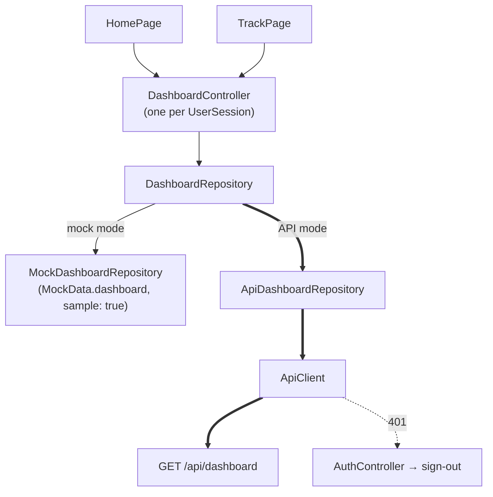

# Phase 4 - Dashboard API Integration

> [!note] Status
> **Complete.** Automated verification passed, and the read-only dashboard was manually verified on the Android emulator against the real backend (see *Manual verification* below). Committed as the Phase 4 checkpoint after `e141846`.

## Goal

In **API mode**, replace the hard-coded day summary on Home and the Track tiles with `GET /dashboard`, **read-only**, keeping the UI and mock mode.

## Architecture

- `Dashboard` holds only what is shown: `date`, `greeting`, `displayName`, `today` (study, steps, sleep and their targets) and `nextExam`, plus a `sample` flag set by the mock. The screens label sample content from that flag.
- `dashboardFromApi` maps `DashboardOut`; other fields are ignored.
- `AppDependencies` gained `dashboard`; `UserSession` owns the controller, loads it on start, and reloads it on app resume (`AppLifecycleListener`).
- The date and greeting come from the server (profile time zone). The app doesn't decide which day it is.

## Verification checklist

- [x] Mapping, including null `sleep_minutes` ("Not logged", not 0) and null `next_exam` ("No exams coming up.") — automated
- [x] Home shows the real greeting, name, date, exam and Study/Activity/Sleep in API mode; no sample figures leak — automated
- [x] Track tiles use the same controller (one `GET /dashboard`) — automated
- [x] Tasks card keeps its `TaskController` meaning; Goals untouched — automated
- [x] Mock mode shows the unchanged sample day — automated
- [x] Load failure → retry; failed refresh keeps the last day and shows a snackbar — automated
- [x] Pull-to-refresh and app-resume refresh — automated
- [x] Switching users never shows the previous user's day (new controller per session) — automated
- [x] Session expiry during a dashboard refresh returns to sign-in — automated
- [x] 200% text on a 360 px phone: no overflow in API-mode Home and Track — automated
- [x] Wiring API mode back to the mock fails 10 tests (mutation check) — automated
- [x] Real backend on the Android emulator — manual (see below)

## Manual verification

In API mode, against the real FastAPI backend on the Android emulator:

- Home showed the signed-in user's real display name and the server's date, with no `SAMPLE DAY`.
- With no upcoming exam, Home showed "No exams coming up."
- After a DBMS subject and a DBMS exam dated 2026-09-29 were created through the backend and Home was refreshed/reloaded, it showed "Your DBMS exam is in 3 days." and "DBMS Exam · Tuesday, September 29".
- With nothing logged: Study `0m / 4h`, Activity `0 / 8,000`, Sleep `Not logged / 8h`.
- The Tasks card stayed on `TaskController`; the long-term Goals stayed visible and unchanged.
- Dark mode checked visually.

**Not manually tested:** non-zero study, activity or sleep figures (the app has no input flows for them yet), and the refresh-failure, app-resume, user-switch and expiry paths, which are covered by automated tests only.

## Remaining sample content

Home "Next up" and "Why?" (daily-plan phase), the "View today's plan" target, and Track "Today's activity". In API mode each carries a `SAMPLE` tag or a sample title.

## Out of scope

Profile / daily-targets editor, Plan, Study, logging, Goals, Insights, and the Tasks card's semantics.

Related: [[Dashboard]] · [[Track]] · [[Profile and Dashboard API]] · [[Backend Integration Roadmap]] · [[Testing]]
