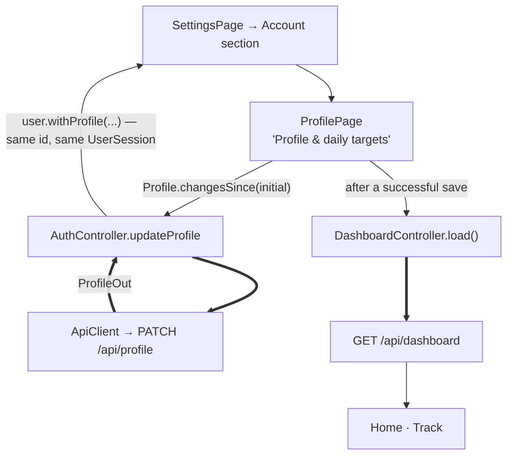

# Phase 5A - Profile and Daily Targets

> [!note] Status
> **Complete.** Automated verification passed, and the editor was manually verified on the Android emulator against the real backend (see *Manual verification* below). Committed as the Phase 5A checkpoint after `fc125e2`. First sub-phase of the Profile / Activity + Sleep / Daily Plan sprint (5A → 5B → 5C).

## Goal

In **API mode**, let the user edit their profile and [[Daily Targets]] inside the app (no Swagger), and see Home and Track follow immediately. Daily targets stay separate from long-term [[Goals]].

## Architecture

- The profile is account data, so it lives on `AuthController` (like change password), not in a feature repository. `/auth/me` already returns it; `User` now holds a `Profile`.
- Only changed fields are sent. The returned `ProfileOut` replaces the profile; the user id is unchanged, so the `UserSession` (keyed by it) is **not** recreated.
- After the save, the dashboard reloads. A load asked for while one is running now fetches once more afterwards, so the refresh can't return pre-save data.
- A failed refresh after a successful save is reported as saved ("Profile saved, but Home couldn't refresh…"), not as a failed save.
- API mode only (mock mode has no account). Mock mode is unchanged.

## Screen

Settings → Account → **Profile & daily targets**: Name, Username (optional, `@`), Time zone (the canonical `commonTimezones` list), then Daily targets: Study (minutes, live "= 4h" helper), Steps, Tasks completed, Sleep (minutes, live helper), Calories (all 0 = off), and Preferred workout time. The copy says long-term Goals are separate. Field errors from the server (422 details, 409 taken username) show on their fields, with a "Check the highlighted fields." message because the form is longer than a screen.

## Verification checklist

- [x] Profile mapping and changed-fields-only diff — automated
- [x] `updateProfile` PATCH body, merge, id kept, 409 and 422 leave the profile unchanged — automated
- [x] New study target shows on Home (`/ 3h`) and Track (`3h goal`) without restart — automated
- [x] New name updates the greeting and Settings; new time zone moves Home to that zone's day — automated
- [x] Taken username on the field; out-of-range values caught before sending; no-change save sends nothing — automated
- [x] Save + failed refresh reported as saved; offline keeps the form; expiry during save returns to sign-in — automated
- [x] Next user sees their own targets — automated
- [x] 200% text on a 360 px phone — automated
- [x] Mutation checks: sending the whole profile, or skipping the dashboard reload, each fail 4 tests — automated
- [x] Real backend on the Android emulator — manual (see below)

## Manual verification

In API mode, against the real FastAPI backend on the Android emulator:

- Settings → Profile & daily targets loaded the real saved profile.
- Study target 240 → 180 minutes: after saving, Home changed from `/ 4h` to `/ 3h` without a restart.
- Step target → 10,000: Home changed to `/ 10,000` immediately.
- Display name changed: the Home greeting showed the new name without a restart.
- Existing dashboard data, including the DBMS exam, stayed intact; dark mode and the Home layout stayed intact.
- After fully quitting and relaunching the API-mode app, the new name, the 3-hour study target and the 10,000-step target persisted.

**Not manually tested** (automated coverage only): username collision, offline save, session expiry during a save, time-zone date switching, and the validation edge cases.

## Known limitations

- Task and calorie targets are editable but not displayed yet.
- A target of 0 shows as `/ 0m` (R11).
- A server field error stays shown until the next save.

## Out of scope

5B Activity/Sleep logging, 5C Daily Plan, Goals, Study, the Tasks card's meaning.

Related: [[Settings]] · [[Daily Targets]] · [[User]] · [[Profile and Dashboard API]] · [[Backend Integration Roadmap]] · [[Testing]]
