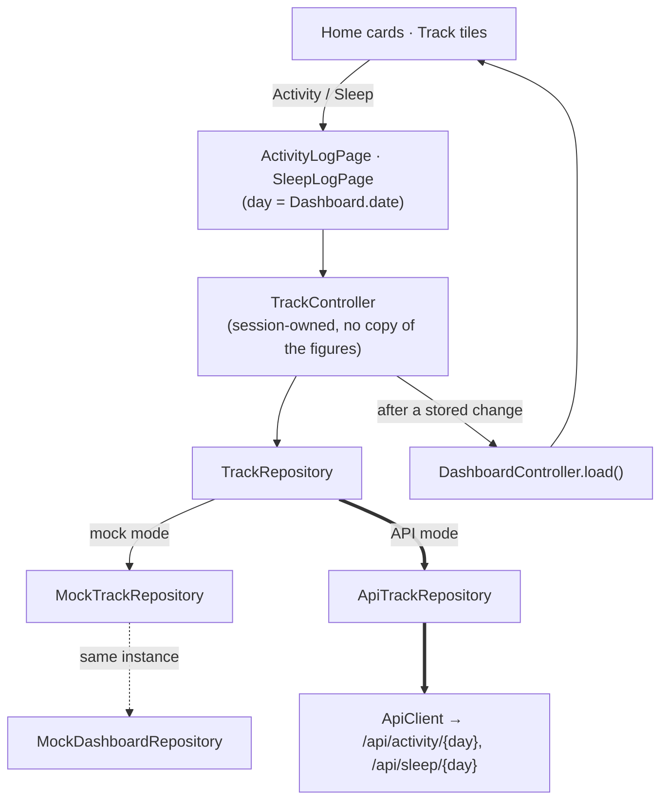

# Phase 5B - Activity and Sleep Logging

> [!note] Status
> **Implemented; automated verification passed; manual emulator verification pending.** Uncommitted on top of `e822b4b` at the time of writing. Second sub-phase of the sprint (5A → **5B** → 5C).

## Goal

Log and edit **today's** activity and sleep inside the app (no Swagger), from the Home and Track cards, with Home and Track updating immediately. Mock mode keeps working.

## Architecture

- **Server day.** The log screens always use `Dashboard.date` (the server's today in the profile time zone). If the dashboard hasn't loaded, the cards don't open a log screen; they say "Today hasn't loaded yet…" instead of inventing a date.
- **Whole-row PUTs.** Both `PUT /activity/{day}` and `PUT /sleep/{day}` replace the stored day. The screens load the stored day first and send every field:
  - activity: `steps`, `workout_done`, `workout_minutes`, `workout_type` (a workout that isn't done is sent with 0 minutes and no type, the backend's own rule, and the screen says so);
  - sleep: `duration_minutes`, `quality`, and the stored `bedtime` and `wake_time` passed back unchanged (not editable yet, shown as "stay as they are").
- **One owner of the figures.** `TrackController` stores the change, then reloads the session's `DashboardController`; it keeps no copy. A refused change throws and doesn't reload. A stored change whose reload fails is reported as saved ("…but Home couldn't refresh"). A busy guard ignores a second change while one is in flight. Deleting an entry that is already gone (404) counts as removed.
- **Mock mode.** `AppDependencies.mock()` builds one `MockTrackRepository` (seeded with the sample 6,240 steps and 6h 42m) and gives the **same instance** to `MockDashboardRepository`, which reads today's steps and sleep from it.

## Navigation

| Card | Home | Track |
|---|---|---|
| Activity | today's activity log | today's activity log |
| Sleep | last night's sleep log | last night's sleep log |
| Tasks | Tasks (unchanged) | Tasks (new) |
| Study | Track tab (unchanged) | not tappable |

Study has no legitimate destination: the only study screen is the Revision detail of the **mock** revision session, which isn't "today's study minutes" and in API mode isn't the user's data. It waits for Study integration.

## Screens

- **Activity:** "Today · {date}", Steps (0–200,000), Workout done switch, then Workout minutes (0–600) and Workout type (optional, ≤40). Validation before sending; server field errors on the field; offline keeps the input; "Saving…" blocks a second save.
- **Sleep:** "The night ending {date}" (plus "not logged yet"), Hours and Minutes, "How did you sleep? (optional)" 1–5, the kept bedtime/wake time line, Save, and **Remove entry** (only when an entry exists, with a confirmation dialog). After removal Home shows **Not logged**.

## Verification checklist

- [x] Mapping (not logged vs 0), whole-day PUT bodies, delete, user scoping, 401/422/503/offline — automated
- [x] Controller: reload only after a stored change; saved-not-refreshed; busy guard; already-deleted — automated
- [x] Cards open the right screens (Home: Activity, Sleep, Tasks, Study → Track; Track: Activity, Sleep, Tasks) — automated
- [x] Pre-fill; editing steps keeps the workout; editing sleep keeps bedtime and wake time; turning the workout off clears it — automated
- [x] Home and Track update at once; removing sleep shows Not logged — automated
- [x] Server day used (fake server day ≠ device day); no log before today loads — automated
- [x] Validation, offline, refresh failure, session expiry, user isolation, mock mode — automated
- [x] 200% text on a 360 px phone, light and dark — automated
- [x] Mutation checks: API wiring to the mock (9 failures), no dashboard reload (9), dropping bedtime (1) — automated
- [ ] Real backend on the Android emulator — **manual pending**

## Known limitations

- Only today can be logged (no day picker); bedtime and wake time aren't editable.
- Study card has no log screen (Study integration pending); no meals.
- Backend tests: D9 clock issue now also affects three activity tests; all pass with `TZ=UTC0`.

## Out of scope

5C Daily Plan, Study alignment, workout progression, nutrition, Insights, Goals backend.

Related: [[Track]] · [[Dashboard]] · [[Fitness and Activity]] · [[Sleep and Recovery]] · [[Activity API]] · [[Sleep API]] · [[Backend Integration Roadmap]] · [[Testing]]
