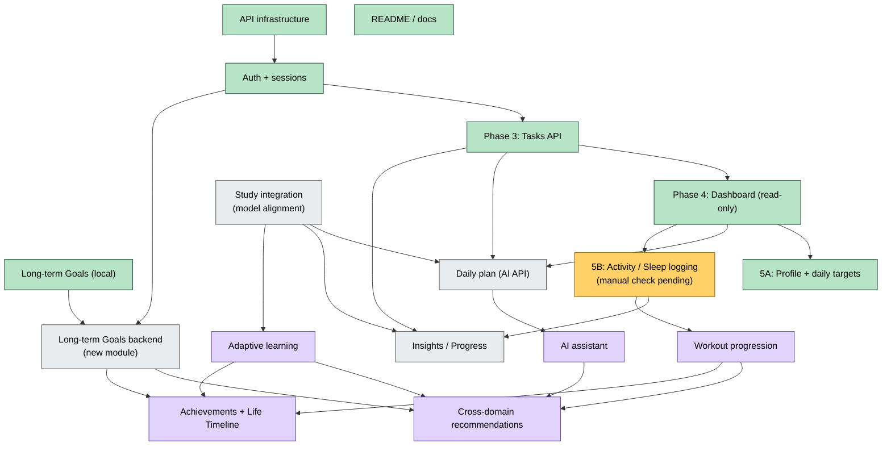

# Roadmap

Intended order with dependencies. **No dates** are set. Sources: `Shehwaar/README.md` roadmap plus the dependency analysis in this vault.

## Completed checkpoints

| Checkpoint | Commit | What it delivered |
|---|---|---|
| Long-term Goals | `d1e908a` | Measurable and completion-only goals, form, Home preview, tests |
| API infrastructure | `10e8ad2` | `ApiClient`, `ApiConfig`, `ApiException`, JSON helpers, `TokenStore`, Android network config, client tests |
| Authentication and sessions | `70864a7` | `AuthController`, auth screen, Settings account, `UserSession`, fake auth backend tests |
| Frontend documentation | `527020e` | `Shehwaar/README.md` rewrite |
| Tasks API integration | `e141846` | `ApiTaskRepository`, `AppDependencies.api`, `/tasks` fake backend, tests. Automated and manual emulator verification passed. |
| Dashboard API integration (read-only) | `fc125e2` | `DashboardRepository` (mock + API), `DashboardController`, Home and Track summary, `/dashboard` fake backend, tests. Automated and manual emulator verification passed. |
| Profile and daily targets (5A) | `e822b4b` | `Profile` model, `AuthController.updateProfile`, Settings "Profile & daily targets", `/profile` fake backend, tests. Automated and manual emulator verification passed. |
| Activity and sleep logging (5B) | uncommitted | `TrackRepository` (mock + API), `TrackController`, Activity and Sleep log screens, card navigation, `/activity` and `/sleep` fake backend, tests. Manual emulator verification pending. |

These were built on the Tasks, Focus, onboarding and design work in the canonical frontend that came before them. See [[Git Checkpoints]].

## Dependency graph

Green = done · Yellow = next · Grey = integration phases · Purple = product vision.

## Sequence

1. **[[Phase 3 - Tasks API Integration]]** (complete)
2. **[[Phase 4 - Dashboard API Integration]]**: `/dashboard` on Home and Track, read-only (complete)
3. **[[Phase 5A - Profile and Daily Targets]]**: `PATCH /profile` from Settings (complete)
4. **[[Phase 5B - Activity and Sleep Logging]]** from Home and Track (implemented; manual emulator verification pending)
5. **5C Daily plan**: replace `samplePlan` with `/ai/daily-plan` (next, same sprint)
6. **Study integration**, then the [[Adaptive Learning Roadmap]]; after 5B, the [[Fitness Roadmap]]
7. **Insights and progress** from real data
8. **Long-term Goals backend**. This is independent of 2–7 and can be scheduled whenever needed.
9. **[[AI Assistant]]**, then cross-domain recommendations ([[AI Roadmap]])
10. **[[Achievements and Life Timeline]]**

Details per integration phase: [[Backend Integration Roadmap]].

Up: [[00 - OMNIA|OMNIA]] · status today: [[Current Status]]
