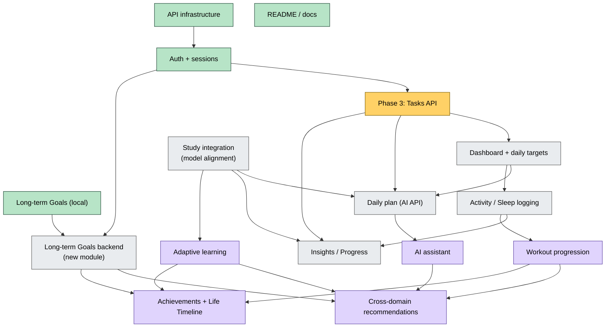

# Roadmap

Intended order with dependencies. **No dates** are set. Sources: `Shehwaar/README.md` roadmap plus the dependency analysis in this vault.

## Completed checkpoints

| Checkpoint | Commit | What it delivered |
|---|---|---|
| Long-term Goals | `d1e908a` | Measurable and completion-only goals, form, Home preview, tests |
| API infrastructure | `10e8ad2` | `ApiClient`, `ApiConfig`, `ApiException`, JSON helpers, `TokenStore`, Android network config, client tests |
| Authentication and sessions | `70864a7` | `AuthController`, auth screen, Settings account, `UserSession`, fake auth backend tests |
| Frontend documentation | `527020e` | `Shehwaar/README.md` rewrite |

These were built on the Tasks, Focus, onboarding and design work in the canonical frontend that came before them. See [[Git Checkpoints]].

## Dependency graph

Green = done · Yellow = next · Grey = integration phases · Purple = product vision.

## Sequence

1. **[[Phase 3 - Tasks API Integration]]** (next)
2. **Dashboard and [[Daily Targets]]**: `/dashboard` on Home and Track, plus a targets editor in Settings
3. **Daily plan**: replace `samplePlan` with `/ai/daily-plan`
4. **Study integration**, then the [[Adaptive Learning Roadmap]]
5. **Activity and sleep** logging, then the [[Fitness Roadmap]]
6. **Insights and progress** from real data
7. **Long-term Goals backend**. This is independent of 2–6 and can be scheduled whenever needed.
8. **[[AI Assistant]]**, then cross-domain recommendations ([[AI Roadmap]])
9. **[[Achievements and Life Timeline]]**

Details per integration phase: [[Backend Integration Roadmap]].

Up: [[00 - OMNIA|OMNIA]] · status today: [[Current Status]]
